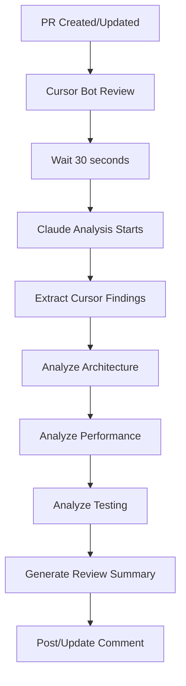

# 🤖 Dual AI Review System Implementation

## 📋 Implementation Summary

I've implemented a comprehensive dual AI review system that integrates **Cursor bot** and **Claude Code** reviews for your GitHub repository.

## 🗂️ Files Created/Modified

### **1. GitHub Actions Workflow**
- **`.github/workflows/ai-reviews.yml`**
  - Triggers on PR open/update/reopen
  - Waits for Cursor bot to complete (30 seconds)
  - Runs Claude analysis with full context
  - Posts/updates review comments automatically
  - Supports manual triggering via workflow_dispatch

### **2. Analysis Scripts**
- **`scripts/claude_review_analyzer.py`**
  - Comprehensive PR analysis (architecture, performance, testing)
  - Extracts and validates Cursor bot findings
  - Generates structured review summaries
  - Supports both automated and manual execution

- **`scripts/post_review_comment.py`**
  - Smart comment management (update existing vs create new)
  - Comment deduplication with unique markers
  - Error handling and logging

- **`scripts/requirements.txt`**
  - Dependencies for review scripts

### **3. Templates & Documentation**
- **`.github/PULL_REQUEST_TEMPLATE.md`** (updated)
  - Added AI review status tracking
  - Comprehensive checklist including AI findings
  - Clear workflow guidance

- **`.github/AI_REVIEW_GUIDE.md`**
  - Complete guide for using dual AI reviews
  - Best practices for developers and reviewers
  - Troubleshooting and optimization tips

- **`AI_REVIEW_IMPLEMENTATION.md`** (this file)
  - Implementation documentation
  - Setup and testing instructions

## 🚀 How It Works

### **Sequential Review Process**


### **Review Focus Areas**

| **Cursor Bot** | **Claude Code** |
|----------------|-----------------|
| 🐛 Syntax & Logic Bugs | 🏗️ Architecture & Design |
| 🔒 Security Vulnerabilities | ⚡ Performance Analysis |
| 📏 Code Style & Best Practices | 🧪 Test Strategy |
| 🚨 Critical Issues | 📚 Documentation Quality |

## 🔧 Setup Instructions

### **1. Enable GitHub Actions**
The workflow is ready to run automatically. No additional setup needed for basic functionality.

### **2. Optional: Manual Testing**
```bash
# Test Claude analysis locally
cd /path/to/repo
python scripts/claude_review_analyzer.py \
  --pr-number 123 \
  --repository owner/repo \
  --output-file test_review.md

# Test comment posting
python scripts/post_review_comment.py \
  --pr-number 123 \
  --repository owner/repo \
  --review-file test_review.md
```

### **3. Customize Analysis (Optional)**
Edit `scripts/claude_review_analyzer.py` to adjust:
- Analysis focus areas
- Comment extraction patterns
- Review summary format

## 📊 Expected Benefits

### **For Developers**
- **Faster Feedback**: Issues caught before human review
- **Better Quality**: Both immediate bugs and architectural guidance
- **Learning**: Understand best practices through AI recommendations
- **Consistency**: Same review standards across all PRs

### **For Reviewers**
- **Pre-screened PRs**: Critical issues already identified
- **Focus on Business Logic**: Less time on syntax, more on requirements
- **Context**: AI provides background on architectural decisions
- **Efficiency**: Structured review format saves time

### **For Project**
- **Reduced Bugs**: Catch issues before they reach production
- **Better Architecture**: Long-term maintainability improvements
- **Knowledge Sharing**: AI reviews document decisions
- **Cost Savings**: Fewer post-merge fixes

## 🧪 Testing the Implementation

### **Test Scenario 1: Bug Fix PR**
1. Create PR with intentional bug (e.g., operator precedence issue)
2. Verify Cursor bot identifies the bug
3. Verify Claude validates the finding and suggests architectural improvements
4. Fix the bug and verify both AIs acknowledge the resolution

### **Test Scenario 2: Feature Addition PR**
1. Create PR adding new functionality
2. Verify Cursor bot checks for security/performance issues
3. Verify Claude analyzes architectural impact and test coverage
4. Review comprehensive feedback from both systems

### **Test Scenario 3: Large Refactoring PR**
1. Create PR with significant architectural changes
2. Verify Claude provides detailed architectural analysis
3. Verify Cursor bot catches any introduced bugs
4. Review how both AIs handle complex changes

## 🎛️ Configuration Options

### **Workflow Triggers**
Current triggers in `.github/workflows/ai-reviews.yml`:
- `pull_request: [opened, synchronize, reopened]`
- `workflow_dispatch` (manual trigger)

### **Comment Management**
- Comments are updated in-place (not duplicated)
- Unique markers prevent comment conflicts
- Old comments are replaced with new analysis

### **Error Handling**
- Graceful degradation if one AI fails
- Artifact uploads for debugging
- Comprehensive logging

## 🔄 Usage Patterns

### **Standard Workflow**
1. Developer opens PR
2. Both AIs review automatically
3. Developer addresses findings
4. Human reviewer focuses on business logic

### **Emergency Hotfix**
```bash
# Skip AI reviews for urgent fixes
gh pr edit PR_NUMBER --add-label "skip-ai-review"
```

### **Complex Architecture Changes**
```bash
# Force detailed review
gh workflow run ai-reviews.yml -f pr_number=PR_NUMBER
```

## 📈 Monitoring & Optimization

### **Success Metrics**
- Review completion time
- Bug detection rate
- Developer satisfaction
- Code quality improvements

### **Optimization Opportunities**
- Adjust Cursor wait time based on performance
- Customize analysis depth for different PR types
- Add integration with project management tools
- Implement cost tracking for API usage

## 🚨 Troubleshooting

### **Reviews Not Triggering**
1. Check GitHub Actions permissions
2. Verify GITHUB_TOKEN is available
3. Ensure PR has actual code changes
4. Check for skip labels

### **Incomplete Analysis**
1. Review GitHub Actions logs
2. Check network connectivity
3. Verify API rate limits
4. Ensure Python dependencies are installed

### **Comment Conflicts**
1. Check comment markers are unique
2. Verify permissions for comment management
3. Review comment posting logic
4. Clear old comments manually if needed

## 🔮 Future Enhancements

### **Immediate (Next 30 Days)**
- [ ] Monitor performance during Cursor free period
- [ ] Gather developer feedback on review quality
- [ ] Fine-tune analysis patterns
- [ ] Add cost tracking

### **Medium Term (Next 3 Months)**
- [ ] Integrate with project management
- [ ] Add review quality metrics
- [ ] Implement different review depths
- [ ] Create review summaries dashboard

### **Long Term (Next 6 Months)**
- [ ] Machine learning for custom patterns
- [ ] Integration with IDE extensions
- [ ] Advanced architectural analysis
- [ ] Team-specific review customization

## ✅ Implementation Complete

The dual AI review system is now fully implemented and ready for use. The system will:

1. **Automatically review all PRs** with both Cursor bot and Claude Code
2. **Provide comprehensive feedback** on bugs, architecture, and performance
3. **Manage comments intelligently** to avoid spam and duplication
4. **Support manual controls** for emergency situations
5. **Track usage and performance** for optimization

**Next Steps:**
1. Test with a few sample PRs
2. Gather team feedback
3. Adjust configuration as needed
4. Monitor Cursor usage during free period
5. Plan for post-July optimization

The implementation maximizes value from your free Cursor access while building a sustainable, high-quality review process.