# Merchant Metadata Integration Architecture

## Current State with Optimization Opportunities

```mermaid
graph TD
    %% OCR Processing Phase
    A[Receipt Image] --> B[OCR Processing]
    B --> C[Raw OCR Data<br/>Lines, Words, Letters]

    %% Merchant Validation Phase (Already Exists)
    C --> D[Merchant Validation<br/>Step Function]
    D --> E[Validate Merchant Lambda]
    E --> F[Google Places API]
    E --> G[OpenAI Normalization]
    F --> H[Receipt Metadata<br/>merchant_name, category,<br/>address, phone, place_id]
    G --> H
    H --> I[(DynamoDB<br/>RECEIPT_METADATA)]

    %% Word Labeling Phase
    C --> J[Word Labeling Process]
    J --> K[Generate Word Labels]
    K --> L[(DynamoDB<br/>RECEIPT_WORD_LABEL)]

    %% Embedding Phase (OPTIMIZATION OPPORTUNITY)
    L --> M[Word Embedding<br/>Step Function]
    M --> N[Prepare Embedding Batch]

    %% Current Flow (Without Metadata)
    N --> O1[Format Word Context<br/>- Word text<br/>- Position<br/>- Surrounding words]

    %% Optimized Flow (With Metadata)
    I -.-> N
    N -.-> O2[Format Enhanced Context<br/>- Word text<br/>- Position<br/>- Surrounding words<br/>- MERCHANT INFO 🎯]

    O1 --> P[Submit to OpenAI<br/>Embeddings API]
    O2 -.-> P

    P --> Q[(Pinecone<br/>Vector Store)]

    %% Label Validation Phase (Already Uses Metadata)
    L --> R[Label Validation<br/>Completion Batch]
    I --> R
    R --> S[Format Validation Prompt<br/>WITH merchant_name ✓]
    S --> T[Submit to OpenAI<br/>Completions API]
    T --> U[Update Label Status]
    U --> L

    style O2 fill:#90EE90
    style I fill:#FFD700
    style H fill:#FFD700
```



## Key Insights

### 1. Merchant Metadata is Already Available
- The `validate_merchant_step_functions` pipeline runs **before** word embedding
- It stores comprehensive merchant data in DynamoDB as `RECEIPT_METADATA`
- This includes canonical merchant names, categories, and location data

### 2. Current Metadata Usage
- ✅ **Label Validation**: Already uses `metadata.merchant_name` in prompts
- ❌ **Word Embedding**: Does NOT use merchant metadata (optimization opportunity)

### 3. Optimization Opportunity
The word embedding process can be enhanced by:
1. Fetching existing `ReceiptMetadata` during batch preparation
2. Including merchant context in embedding prompts
3. No additional API calls needed - data already exists!

## Implementation Strategy

### Phase 1: Enhanced Word Embeddings
```python
# In embedding/word/submit.py
def _format_word_context_embedding_input(
    word: ReceiptWord,
    words: list[ReceiptWord],
    metadata: ReceiptMetadata  # NEW PARAMETER
) -> str:
    # Existing context formatting...

    # Add merchant context
    merchant_context = f"<MERCHANT>{metadata.merchant_name}</MERCHANT>"
    if metadata.merchant_category:
        merchant_context += f" <CATEGORY>{metadata.merchant_category}</CATEGORY>"

    return (
        f"{merchant_context} "  # Prepend merchant info
        f"<TARGET>{word.text}</TARGET> <POS>{_get_word_position(word)}</POS> "
        f"<CONTEXT>{left_text} {right_text}</CONTEXT>"
    )
```

### Phase 2: Update Step Function Handlers
```python
# In prepare_embedding_batch_handler.py
def submit_handler(event, context):
    # Existing code...

    # For each batch, fetch metadata
    for image_id, receipts in batches.items():
        for receipt_id in receipts:
            metadata = client_manager.dynamo.get_receipt_metadata(
                image_id, receipt_id
            )
            # Pass metadata to formatting functions
```

## Benefits

1. **Better Embeddings**: Words embedded with merchant context will cluster better
2. **No Additional Costs**: Reuses existing data from merchant validation
3. **Improved Label Quality**: Context-aware embeddings lead to better label predictions
4. **Minimal Code Changes**: Only affects embedding formatting, not infrastructure

## Dependency Chain

```
1. OCR Processing ─────────┐
                          ├─→ 3. Word Labeling
2. Merchant Validation ────┘        │
                                   ↓
                          4. Word Embedding (can use metadata from step 2)
                                   ↓
                          5. Label Validation (already uses metadata from step 2)
```

The key insight is that merchant validation (step 2) runs in parallel with initial labeling, so by the time we need to create embeddings, the merchant metadata is already available in DynamoDB.
