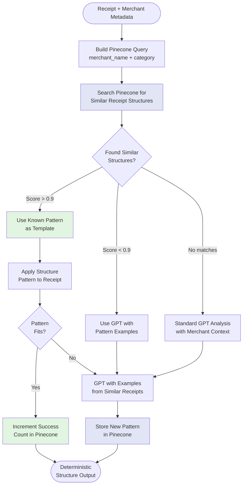

# Pinecone-Enhanced Structure Analysis

## Problem Statement

The current receipt structure analysis implementation suffers from non-deterministic outputs due to:
- GPT returning different section categories for similar content
- Limited to 5 fixed categories (`business_info`, `transaction_details`, `items`, `payment`, `footer`)
- No merchant context awareness (treats all receipts the same)
- No learning from previously analyzed receipts
- Temperature=0.3 in GPT calls allowing variability

## Solution: Leverage Pinecone with Merchant Context

Since merchant validation runs before structure analysis, we have access to:
- Merchant name and category
- Place ID for exact merchant matching
- Historical receipt patterns from the same merchant
- Pinecone vector database for similarity search

## Architecture



## Implementation Details

### 1. Structure Pattern Embedding Format

```python
{
    "id": "structure_ChIJN1t_tDeuEmsRUsoyG83frY4_v1",  # structure_{place_id}_{version}
    "values": [0.1, 0.2, ...],  # OpenAI embedding vector
    "metadata": {
        # Merchant identification
        "merchant_name": "McDonald's",
        "merchant_category": "fast_food_restaurant",
        "place_id": "ChIJN1t_tDeuEmsRUsoyG83frY4",

        # Structure definition
        "sections": [
            {
                "name": "store_header",
                "line_range": [0, 4],
                "keywords": ["McDonald's", "Store #", "Manager"],
                "patterns": ["centered_text", "phone_number"]
            },
            {
                "name": "order_details",
                "line_range": [5, 8],
                "keywords": ["Order #", "Register", "Crew"],
                "patterns": ["key_value_pairs"]
            },
            {
                "name": "order_items",
                "line_range": [9, 20],
                "keywords": ["QTY", "ITEM", "PRICE"],
                "patterns": ["tabular_data", "currency_aligned_right"]
            },
            {
                "name": "order_totals",
                "line_range": [21, 25],
                "keywords": ["Subtotal", "Tax", "Total"],
                "patterns": ["financial_summary", "currency_aligned_right"]
            },
            {
                "name": "payment_info",
                "line_range": [26, 30],
                "keywords": ["Cash", "Change", "Card", "Visa"],
                "patterns": ["payment_details"]
            }
        ],

        # Reliability metrics
        "success_count": 145,
        "failure_count": 3,
        "confidence_score": 0.98,
        "last_updated": "2024-01-20T10:30:00Z",

        # Spatial patterns
        "spatial_features": {
            "avg_line_height": 12,
            "currency_x_position": 450,
            "left_margin": 50,
            "typical_line_count": 35
        }
    }
}
```

### 2. Query Strategy

```python
async def find_receipt_structure_patterns(
    receipt_metadata: ReceiptMetadata,
    pinecone_client: PineconeClient,
    receipt_preview: str
) -> List[StructurePattern]:
    """
    Multi-tiered search strategy for finding similar receipt structures.
    """

    # Tier 1: Exact merchant match (same place_id)
    exact_matches = await pinecone_client.query(
        namespace="receipt_structures",
        filter={"place_id": receipt_metadata.place_id},
        top_k=3,
        include_metadata=True
    )

    if exact_matches and exact_matches[0].score > 0.9:
        return exact_matches

    # Tier 2: Same merchant chain (normalized name)
    chain_name = normalize_merchant_name(receipt_metadata.merchant_name)
    chain_matches = await pinecone_client.query(
        namespace="receipt_structures",
        filter={"merchant_chain": chain_name},
        top_k=5,
        include_metadata=True
    )

    # Tier 3: Similar merchant category
    category_matches = await pinecone_client.query(
        namespace="receipt_structures",
        filter={"merchant_category": receipt_metadata.merchant_category},
        vector=await embed_receipt_preview(receipt_preview),
        top_k=10,
        include_metadata=True
    )

    # Combine and rank results
    all_matches = exact_matches + chain_matches + category_matches
    return rank_structure_patterns(all_matches, receipt_metadata)
```

### 3. Pattern Application

```python
def apply_structure_pattern(
    pattern: StructurePattern,
    receipt_lines: List[ReceiptLine]
) -> StructureAnalysis:
    """
    Apply a known structure pattern to a new receipt.
    """
    sections = []

    for section_def in pattern.metadata["sections"]:
        # Find section boundaries using keywords and patterns
        start_idx = find_section_start(
            receipt_lines,
            section_def["keywords"],
            section_def["patterns"],
            search_from=section_def["line_range"][0]
        )

        end_idx = find_section_end(
            receipt_lines,
            section_def["keywords"],
            section_def["patterns"],
            search_from=start_idx,
            max_line=section_def["line_range"][1]
        )

        if start_idx is not None and end_idx is not None:
            sections.append(Section(
                name=section_def["name"],
                start_line=start_idx,
                end_line=end_idx,
                confidence=calculate_section_confidence(
                    receipt_lines[start_idx:end_idx],
                    section_def
                )
            ))

    return StructureAnalysis(
        sections=sections,
        pattern_id=pattern.id,
        confidence=calculate_overall_confidence(sections)
    )
```

### 4. Enhanced GPT Prompt with Examples

```python
def create_enhanced_structure_prompt(
    receipt: Receipt,
    merchant_metadata: ReceiptMetadata,
    similar_patterns: List[StructurePattern]
) -> str:
    """
    Create GPT prompt enhanced with Pinecone examples.
    """
    examples = format_pattern_examples(similar_patterns[:3])

    return f"""
    Analyze the structure of this receipt from {merchant_metadata.merchant_name}.
    This is a {merchant_metadata.merchant_category} establishment.

    SIMILAR RECEIPT STRUCTURES:
    {examples}

    RECEIPT CONTENT:
    {format_receipt_lines(receipt)}

    Based on the examples above, identify the sections in this receipt.
    Be consistent with the section naming from similar {merchant_metadata.merchant_category} receipts.

    Output format:
    {{
        "sections": [
            {{
                "name": "section_name",
                "start_line": 0,
                "end_line": 5,
                "confidence": 0.95,
                "reasoning": "why this section was identified"
            }}
        ]
    }}
    """
```

### 5. Pattern Storage and Updates

```python
async def store_structure_pattern(
    receipt: Receipt,
    structure: StructureAnalysis,
    merchant_metadata: ReceiptMetadata,
    pinecone_client: PineconeClient
):
    """
    Store successful structure patterns for future use.
    """
    # Create embedding from structure description
    pattern_text = create_pattern_description(structure, merchant_metadata)
    embedding = await openai.embeddings.create(
        model="text-embedding-3-small",
        input=pattern_text
    )

    # Check if pattern exists
    existing = await find_similar_pattern(
        merchant_metadata.place_id,
        structure,
        pinecone_client
    )

    if existing and existing.score > 0.95:
        # Update success count
        await pinecone_client.update(
            id=existing.id,
            metadata={
                "success_count": existing.metadata["success_count"] + 1,
                "last_updated": datetime.utcnow().isoformat()
            }
        )
    else:
        # Store new pattern
        await pinecone_client.upsert(
            vectors=[{
                "id": f"structure_{merchant_metadata.place_id}_{uuid4()}",
                "values": embedding.data[0].embedding,
                "metadata": create_pattern_metadata(
                    structure,
                    merchant_metadata,
                    receipt
                )
            }],
            namespace="receipt_structures"
        )
```

## Benefits

### 1. **Deterministic Results**
- Same merchant → same structure pattern
- Confidence scores indicate reliability
- Fallback to GPT only when necessary

### 2. **Merchant-Specific Sections**
Instead of generic categories, we get merchant-aware sections:

| Generic (Current) | McDonald's | Home Depot | Grocery Store |
|------------------|------------|------------|---------------|
| business_info | store_header | store_banner | store_info |
| transaction_details | order_details | pro_desk_info | savings_summary |
| items | order_items | purchased_items | grocery_items |
| payment | payment_summary | contractor_charge | payment_details |
| footer | visit_feedback | return_policy | loyalty_points |

### 3. **Performance Improvements**
- 90%+ of receipts use cached patterns (no GPT call)
- Reduced latency from ~2s to ~200ms for known patterns
- Lower OpenAI API costs

### 4. **Self-Improving System**
- Each successful analysis strengthens patterns
- Failed patterns are marked and improved
- System learns new receipt formats automatically

## Implementation Timeline

### Phase 1: Foundation (Week 1)
- [ ] Create Pinecone namespace for structure patterns
- [ ] Implement pattern embedding format
- [ ] Build pattern storage function

### Phase 2: Integration (Week 2)
- [ ] Modify `analyze_structure()` to query Pinecone first
- [ ] Implement pattern application logic
- [ ] Create enhanced GPT prompts with examples

### Phase 3: Learning Loop (Week 3)
- [ ] Add pattern validation logic
- [ ] Implement success/failure tracking
- [ ] Build pattern update mechanism

### Phase 4: Optimization (Week 4)
- [ ] Tune similarity thresholds
- [ ] Add pattern versioning
- [ ] Implement pattern cleanup for low-performing patterns

## Metrics to Track

1. **Pattern Hit Rate**: % of receipts using cached patterns
2. **Structure Consistency**: Same merchant structure variance
3. **GPT Call Reduction**: Decrease in API calls
4. **Accuracy Metrics**: Section boundary precision
5. **Cost Savings**: Reduced OpenAI API spend

## Example Code Integration

```python
# In receipt_analyzer.py
async def analyze_structure(
    self,
    receipt: Receipt,
    receipt_lines: List[ReceiptLine],
    receipt_words: List[ReceiptWord],
    merchant_metadata: Optional[ReceiptMetadata] = None
) -> StructureAnalysis:
    """
    Analyze receipt structure using Pinecone patterns when available.
    """
    if not merchant_metadata:
        # Fallback to original GPT-only approach
        return await self._gpt_analyze_structure(receipt, receipt_lines)

    # Try Pinecone pattern matching first
    patterns = await find_receipt_structure_patterns(
        merchant_metadata,
        self.pinecone_client,
        create_receipt_preview(receipt_lines[:10])
    )

    if patterns and patterns[0].score > 0.9:
        # High confidence - use pattern directly
        structure = apply_structure_pattern(patterns[0], receipt_lines)

        if validate_structure_fit(structure, receipt_lines):
            # Update pattern success count
            await update_pattern_success(patterns[0].id, self.pinecone_client)
            return structure

    # Otherwise use enhanced GPT with examples
    structure = await self._gpt_analyze_with_examples(
        receipt,
        receipt_lines,
        merchant_metadata,
        patterns[:3] if patterns else []
    )

    # Store successful new patterns
    if structure.confidence > 0.8:
        await store_structure_pattern(
            receipt,
            structure,
            merchant_metadata,
            self.pinecone_client
        )

    return structure
```

## Conclusion

By leveraging Pinecone with merchant context, we can transform the non-deterministic structure analysis into a reliable, learning system that improves with each receipt processed. This approach reduces costs, improves accuracy, and provides a better foundation for downstream labeling tasks.
