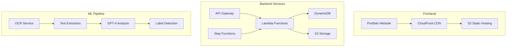

# System Architecture Overview

## High-Level Architecture

The Portfolio & Receipt Processing System consists of two main components:

## Components

### Frontend Layer
- **Portfolio Website**: React/Next.js application with server-side rendering
- **CDN**: CloudFront distribution for global content delivery
- **Static Assets**: S3 bucket for images, styles, and built artifacts

### API Layer
- **API Gateway**: RESTful API with caching and rate limiting
- **Lambda Functions**: Serverless compute for API endpoints
- **Authentication**: JWT-based authentication (when needed)

### Data Layer
- **DynamoDB**: NoSQL database for receipt metadata and processing results
- **S3**: Object storage for receipt images and processed data
- **ElasticSearch**: Full-text search capabilities (optional)

### Processing Pipeline
- **OCR Engine**: Text extraction from receipt images
- **ML Models**: GPT-4 for intelligent field extraction
- **Step Functions**: Orchestration of multi-step processing workflows

## Data Flow

1. **Receipt Upload**: User uploads receipt image via web interface
2. **Storage**: Image stored in S3 with presigned URL generation
3. **OCR Processing**: Lambda triggers OCR extraction
4. **ML Analysis**: GPT-4 analyzes extracted text for field detection
5. **Data Storage**: Results stored in DynamoDB with metadata
6. **Query Interface**: API provides filtered access to processed receipts

## Scalability Considerations

- **Serverless Architecture**: Auto-scaling based on demand
- **DynamoDB On-Demand**: Automatic capacity management
- **Lambda Concurrency**: Configured limits prevent cost overruns
- **S3 Lifecycle Policies**: Automatic archival of old receipts

## Security

- **IAM Roles**: Least-privilege access for all services
- **VPC Endpoints**: Private communication between services
- **Encryption**: At-rest and in-transit encryption
- **API Keys**: Rate limiting and usage tracking

## Cost Optimization

- **Reserved Capacity**: DynamoDB reserved capacity for predictable workloads
- **S3 Storage Classes**: Intelligent tiering for cost optimization
- **Lambda ARM**: Using Graviton processors for better price/performance
- **CloudFront Caching**: Reduced origin requests

## Monitoring

- **CloudWatch**: Metrics, logs, and alarms
- **X-Ray**: Distributed tracing for debugging
- **Custom Dashboards**: Business metrics and KPIs
- **Cost Explorer**: Budget tracking and anomaly detection