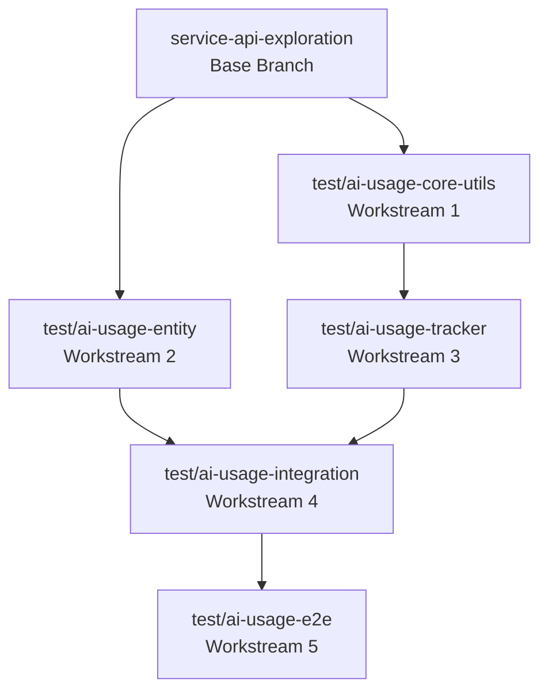

# AI Usage Tracking Testing Strategy

## Overview
This document outlines the testing strategy for the AI Usage Tracking system, including branch structure, parallel development approach, and implementation guidelines.

## Branch Structure

### Base Branch
- **Name:** `service-api-exploration`
- **Purpose:** Base feature branch containing testing strategy and shared test utilities

### Feature Branches (via git worktree)
All branches are created from `service-api-exploration` base:

```
service-api-exploration (base)
├── test/ai-usage-core-utils
├── test/ai-usage-entity
├── test/ai-usage-tracker
├── test/ai-usage-integration
└── test/ai-usage-e2e
```

## Workstream Dependencies



## Parallel Development Plan

### Independent Workstreams (Can Start Immediately)

#### Workstream 1: Core Utilities Testing
- **Branch:** `test/ai-usage-core-utils`
- **Files:**
  - `receipt_label/tests/test_cost_calculator.py`
  - `receipt_label/tests/fixtures/ai_pricing_data.json`
- **Dependencies:** None
- **Test Count:** ~20 unit tests
- **Marks:** `@pytest.mark.unit`

#### Workstream 2: Entity & Data Layer Testing
- **Branch:** `test/ai-usage-entity`
- **Files:**
  - `receipt_dynamo/tests/test_ai_usage_metric.py`
  - `receipt_dynamo/tests/test_ai_usage_queries.py`
- **Dependencies:** None (uses moto for AWS mocking)
- **Test Count:** ~25 unit tests
- **Marks:** `@pytest.mark.unit`

### Dependent Workstreams

#### Workstream 3: Tracker Components Testing
- **Branch:** `test/ai-usage-tracker`
- **Files:**
  - `receipt_label/tests/test_ai_usage_tracker.py`
  - `receipt_label/tests/test_openai_wrapper.py`
- **Dependencies:** Workstream 1 (needs CostCalculator)
- **Test Count:** ~25 unit tests
- **Marks:** `@pytest.mark.unit`

#### Workstream 4: Integration Testing
- **Branch:** `test/ai-usage-integration`
- **Files:**
  - `receipt_label/tests/test_client_manager_integration.py`
  - `infra/routes/ai_usage/handler/test_handler.py`
- **Dependencies:** Workstreams 1, 2, 3
- **Test Count:** ~18 integration tests
- **Marks:** `@pytest.mark.integration`

#### Workstream 5: End-to-End Testing
- **Branch:** `test/ai-usage-e2e`
- **Files:**
  - `receipt_label/tests/end_to_end/test_ai_usage_e2e.py`
- **Dependencies:** Workstream 4
- **Test Count:** ~8 e2e tests
- **Marks:** `@pytest.mark.end_to_end`

## Merging Strategy

1. **Daily Syncs:** Each workstream rebases from base branch daily
2. **Merge Order:**
   - Week 1: WS1 and WS2 merge to base
   - Week 2: WS3 merges to base
   - Week 3: WS4 merges to base
   - Week 4: WS5 merges, then base merges to main

## Test Implementation Guidelines

### Unit Tests (`@pytest.mark.unit`)
- Mock all external dependencies
- Test single units in isolation
- Use `pytest-mock` for mocking
- Use `moto` for AWS service mocking

### Integration Tests (`@pytest.mark.integration`)
- Test component interactions
- Mock external services but use real internal components
- Verify data flow between components

### End-to-End Tests (`@pytest.mark.end_to_end`)
- Minimal tests with real services
- Use small, cheap API calls
- Document costs in test docstrings
- Skip in CI by default

## Shared Test Utilities

Create in base branch for all workstreams to use:

```python
# receipt_label/tests/utils/ai_usage_helpers.py
def create_mock_usage_metric(**kwargs):
    """Factory for test AIUsageMetric objects"""

def create_mock_openai_response(tokens_used):
    """Factory for mock OpenAI responses"""
```

## Success Criteria

- [ ] 90%+ code coverage for AI usage tracking components
- [ ] All tests pass with `pytest -m "not end_to_end"`
- [ ] Clear documentation for running e2e tests
- [ ] Performance: Full test suite runs in <30 seconds (excluding e2e)
