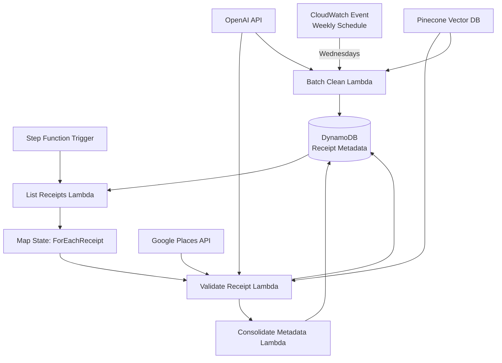

# Validate Merchant Step Functions

A comprehensive AWS Step Functions-based system for validating and consolidating merchant data from receipt metadata. This infrastructure provides both real-time and batch processing capabilities to maintain accurate canonical merchant representations.

## 📋 Table of Contents

- [Overview](#overview)
- [Architecture](#architecture)
- [Components](#components)
- [Workflow Phases](#workflow-phases)
- [Lambda Functions](#lambda-functions)
- [Configuration](#configuration)
- [Deployment](#deployment)
- [Usage](#usage)
- [Monitoring](#monitoring)
- [Troubleshooting](#troubleshooting)

## 🎯 Overview

This module implements a three-phase merchant validation system:

1. **Real-time validation** - Processes new receipts as they're ingested
2. **Incremental consolidation** - Updates canonical merchant data after each validation
3. **Weekly batch cleaning** - Comprehensive data reconciliation every Wednesday

The system ensures merchant data consistency by:
- Enriching receipt metadata with Google Places information
- Normalizing merchant names and addresses using OpenAI
- Clustering similar merchants to establish canonical representations
- Detecting and flagging geographic discrepancies

## 🏗️ Architecture



## 🔧 Components

### Infrastructure (Pulumi)

- **ValidateMerchantStepFunctions** - Main Pulumi component class
- **Step Function State Machine** - Orchestrates the validation workflow
- **CloudWatch Events Rule** - Schedules weekly batch processing
- **IAM Roles & Policies** - Service permissions for Lambda and Step Functions
- **Lambda Layers** - Shared dependencies (dynamo_layer, label_layer)

### Step Function States

1. **ListReceipts** - Identifies receipts requiring validation
2. **ForEachReceipt** - Map state for parallel processing (max concurrency: 5)
3. **ConsolidateMetadata** - Merges validation results

## 📊 Workflow Phases

### Phase 1: Real-time Validation

Triggered on-demand or after receipt OCR ingestion:

```json
{
  "StartAt": "ListReceipts",
  "States": {
    "ListReceipts": {
      "Type": "Task",
      "Resource": "list_receipts_lambda_arn",
      "Next": "ForEachReceipt"
    },
    "ForEachReceipt": {
      "Type": "Map",
      "ItemsPath": "$.receipts",
      "MaxConcurrency": 5,
      "Iterator": {
        "StartAt": "ValidateReceipt",
        "States": {
          "ValidateReceipt": {
            "Type": "Task",
            "Resource": "validate_receipt_lambda_arn",
            "End": true
          }
        }
      },
      "Next": "ConsolidateMetadata"
    },
    "ConsolidateMetadata": {
      "Type": "Task",
      "Resource": "consolidate_metadata_lambda_arn",
      "End": true
    }
  }
}
```

### Phase 2: Incremental Consolidation

After each receipt validation:
- Matches new receipts with existing merchants by place_id
- Copies canonical values from matched records
- Self-canonizes new merchants without matches

### Phase 3: Weekly Batch Cleaning

Scheduled every Wednesday at midnight UTC:
- Processes ALL merchant records
- Clusters similar merchants
- Performs geographic validation
- Updates canonical representations
- Collapses duplicate aliases

## 🚀 Lambda Functions

### 1. list_receipts_handler.py
**Purpose**: Queries DynamoDB for receipts needing merchant validation  
**Trigger**: Step Function start  
**Output**: List of receipt identifiers (image_id, receipt_id)  
**Timeout**: 900s  
**Memory**: 512MB  

### 2. validate_single_receipt_handler_v2.py
**Purpose**: Enriches individual receipts with merchant data  
**Trigger**: ForEachReceipt Map state  
**Key Features**:
- Google Places API integration
- Address normalization
- Merchant name standardization
- Place ID resolution  
**Timeout**: 900s  
**Memory**: 512MB  

### 3. consolidate_new_metadata_handler.py
**Purpose**: Updates canonical merchant information  
**Trigger**: After ForEachReceipt completion  
**Key Features**:
- Processes validation results
- Updates canonical fields
- Self-canonizes new merchants  
**Timeout**: 300s  
**Memory**: 512MB  
**Code Quality**: Refactored with 10.00/10 pylint score

### 4. batch_clean_merchants_handler.py
**Purpose**: Comprehensive merchant data reconciliation  
**Trigger**: CloudWatch Events (weekly)  
**Key Features**:
- Clusters similar merchants
- Geographic validation
- Canonical data propagation
- Alias consolidation  
**Timeout**: 900s  
**Memory**: 512MB  
**Code Quality**: 9.81/10 pylint score

## ⚙️ Configuration

### Environment Variables

All Lambda functions require:

```bash
DYNAMO_TABLE_NAME=your-dynamodb-table
OPENAI_API_KEY=sk-...
GOOGLE_PLACES_API_KEY=AIza...
PINECONE_API_KEY=...
PINECONE_INDEX_NAME=merchant-embeddings
PINECONE_HOST=https://...
```

### Pulumi Configuration

```yaml
config:
  portfolio:OPENAI_API_KEY:
    secure: <encrypted-key>
  portfolio:GOOGLE_PLACES_API_KEY:
    secure: <encrypted-key>
  portfolio:PINECONE_API_KEY:
    secure: <encrypted-key>
  portfolio:PINECONE_INDEX_NAME: merchant-embeddings
  portfolio:PINECONE_HOST: https://...
```

## 🚢 Deployment

1. **Prerequisites**:
   ```bash
   pip install pulumi pulumi-aws
   ```

2. **Deploy infrastructure**:
   ```bash
   cd infra
   pulumi up -s dev
   ```

3. **Verify deployment**:
   - Check Step Function in AWS Console
   - Verify CloudWatch Events rule is enabled
   - Confirm Lambda functions have correct environment variables

## 📖 Usage

### Manual Step Function Execution

```bash
# Via AWS CLI
aws stepfunctions start-execution \
  --state-machine-arn arn:aws:states:region:account:stateMachine:name \
  --input '{}'

# Via AWS Console
# Navigate to Step Functions → State machines → Start execution
```

### Manual Batch Cleaning

```bash
# Invoke with custom parameters
aws lambda invoke \
  --function-name validate-merchant-batch-clean-merchants \
  --payload '{"max_records": 1000, "geographic_validation": true}' \
  output.json
```

### Monitoring Execution

```python
# Example: Check Step Function execution status
import boto3

client = boto3.client('stepfunctions')
response = client.describe_execution(
    executionArn='arn:aws:states:...:execution:...'
)
print(f"Status: {response['status']}")
```

## 📊 Monitoring

### CloudWatch Metrics

- **Step Function Metrics**:
  - ExecutionsSucceeded
  - ExecutionsFailed
  - ExecutionTime
  
- **Lambda Metrics**:
  - Invocations
  - Errors
  - Duration
  - Concurrent Executions

### CloudWatch Logs

Each Lambda function logs to:
```
/aws/lambda/{function-name}
```

Key log patterns to monitor:
- `ERROR` - Processing failures
- `WARNING` - Data quality issues
- `Geographic discrepancy detected` - Location mismatches
- `Successfully updated` - Successful updates

### Alarms (Recommended)

```python
# Example CloudWatch alarm for failed executions
alarm = cloudwatch.Alarm(
    "merchant-validation-failures",
    comparison_operator="GreaterThanThreshold",
    evaluation_periods=1,
    metric_name="ExecutionsFailed",
    namespace="AWS/States",
    period=300,
    statistic="Sum",
    threshold=1,
    alarm_description="Alert on merchant validation failures"
)
```

## 🔍 Troubleshooting

### Common Issues

1. **Step Function Timeout**
   - Check Lambda function logs for long-running operations
   - Consider increasing Lambda timeout or reducing batch size

2. **DynamoDB Throttling**
   - Error: `ProvisionedThroughputExceededException`
   - Solution: Implement exponential backoff or increase DynamoDB capacity

3. **API Rate Limits**
   - Google Places API: Check quota in Google Cloud Console
   - OpenAI API: Monitor rate limit headers in responses

4. **Missing Merchant Data**
   - Verify receipt has been processed by OCR
   - Check if metadata exists in DynamoDB
   - Ensure place_id is valid

### Debug Commands

```bash
# Check recent Step Function executions
aws stepfunctions list-executions \
  --state-machine-arn arn:aws:states:... \
  --max-results 10

# View Lambda logs
aws logs tail /aws/lambda/validate-merchant-list-receipts --follow

# Query DynamoDB for specific receipt
aws dynamodb get-item \
  --table-name receipts \
  --key '{"image_id": {"S": "..."}, "receipt_id": {"N": "1"}}'
```

## 🧪 Testing

### Unit Tests

Run tests for individual handlers:
```bash
cd infra
python -m pytest validate_merchant_step_functions/test_*.py
```

### Integration Tests

Test the complete workflow:
```python
# test_integration.py
def test_merchant_validation_workflow():
    # 1. Insert test receipt in DynamoDB
    # 2. Trigger Step Function
    # 3. Verify canonical data updated
    # 4. Clean up test data
```

## 🤝 Contributing

1. Ensure code quality:
   ```bash
   python -m pylint validate_merchant_step_functions/*.py
   python -m mypy validate_merchant_step_functions/*.py
   ```

2. Update tests for new features

3. Document any new environment variables or configuration

## 📝 Related Documentation

- [Receipt Label Merchant Validation Module](../../receipt_label/merchant_validation/README.md)
- [DynamoDB Schema Documentation](../dynamo_db/README.md)
- [Lambda Layer Dependencies](../lambda_layer/README.md)

## 🔒 Security Considerations

- All API keys are stored as Pulumi secrets
- Lambda functions use least-privilege IAM policies
- DynamoDB access is restricted to specific table operations
- No sensitive data is logged

## 📈 Performance Optimization

- Map state concurrency limited to 5 to prevent API throttling
- Batch operations used where possible in DynamoDB
- Lambda memory sized appropriately for workload
- Weekly batch processing scheduled during low-traffic period

---

**Note**: For validating word labels grouped by merchant (rather than per-receipt validation), see the [validation_by_merchant](../validation_by_merchant) module.