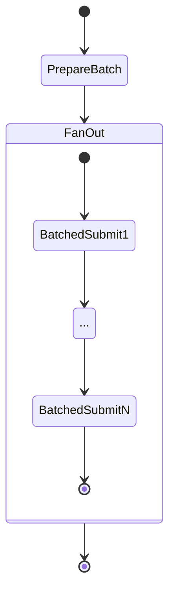

# Word Label Step Functions

This module defines the Submit Embedding Batch Step Function workflow, which orchestrates the process of generating, uploading, and embedding receipt word label batches using OpenAI and Pinecone.

## Purpose

The workflow automates the following:

- Fetching receipt word labels and associated words from DynamoDB
- Formatting them into embedding-ready NDJSON batches
- Uploading the NDJSON to S3
- Submitting batches to OpenAI for embedding (in parallel)
- Tracking status in DynamoDB for audit and validation

## Architecture

The Step Function has two main Lambda tasks:

1. **PrepareBatch Lambda**

   - Reads unvalidated receipt word labels
   - Joins them with word OCR data
   - Chunks into batches of 500
   - Writes NDJSON to S3
   - Returns a list of batch IDs and S3 paths

2. **SubmitBatch Lambda**
   - Fanned out via `Map` state for each batch
   - Reads NDJSON from S3
   - Submits to OpenAI Batch Embedding API
   - Logs batch metadata and results

## S3 Bucket

An S3 bucket is created per Pulumi stack to store the NDJSON files used by the workflow. This bucket is passed to both Lambdas via environment variable `S3_BUCKET`.

## Step Function Diagram

## Permissions

The Lambda execution role is granted:

- DynamoDB access for reading/writing batch and label metadata
- S3 Put/Get access to the embedding batch bucket
- Access to invoke both Lambdas

The Step Function execution role is granted:

- `lambda:InvokeFunction` permission on the Prepare and Submit Lambdas

## Deployment

This resource is created using Pulumi as part of the `portfolio` stack. It wires together IAM, Lambda, S3, and Step Functions to support a scalable embedding pipeline.
