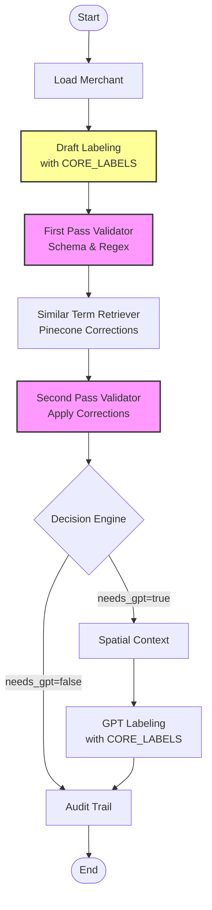

# Phase 3: CORE_LABELS Integration

## Overview

The enhanced workflow (workflow_v3.py) integrates the CORE_LABELS corpus as the authoritative taxonomy for receipt labeling. This ensures consistency with the OpenAI Agents SDK approach while adding multi-pass validation.

## CORE_LABELS Corpus

The predefined label taxonomy includes 20 label types:

### Merchant & Store Info
- `MERCHANT_NAME`: Trading name or brand of the store
- `STORE_HOURS`: Business hours
- `PHONE_NUMBER`: Store's telephone number
- `WEBSITE`: Web or email address
- `LOYALTY_ID`: Customer rewards identifier

### Location
- `ADDRESS_LINE`: Full address printed on receipt

### Transaction Info
- `DATE`: Calendar date of transaction
- `TIME`: Time of transaction
- `PAYMENT_METHOD`: Payment instrument (e.g., VISA ••••1234)
- `COUPON`: Coupon code reducing price
- `DISCOUNT`: Non-coupon discount

### Line Items
- `PRODUCT_NAME`: Descriptive text of purchased product
- `QUANTITY`: Numeric count or weight
- `UNIT_PRICE`: Price per single unit
- `LINE_TOTAL`: Extended price for line

### Totals & Taxes
- `SUBTOTAL`: Sum before tax and discounts
- `TAX`: Any tax line
- `GRAND_TOTAL`: Final amount due

## Enhanced Workflow with CORE_LABELS



## Key Enhancements

### 1. Draft Labeling Node
- Maps Phase 2 patterns to CORE_LABELS taxonomy
- Applies spatial heuristics with proper label types
- Each label includes the CORE_LABELS description

Example mapping:
```python
pattern_to_core_label = {
    "DATE": "DATE",
    "TIME": "TIME", 
    "PHONE_NUMBER": "PHONE_NUMBER",
    "CURRENCY": None,  # Needs context to determine
}
```

### 2. First Pass Validator
- Validates against CORE_LABELS taxonomy
- Applies regex patterns for format checking
- Detects duplicates (except line items)

Validation patterns:
```python
LABEL_VALIDATION_PATTERNS = {
    "DATE": r'^\d{1,2}[/-]\d{1,2}[/-]\d{2,4}$',
    "TIME": r'^\d{1,2}:\d{2}(:\d{2})?(\s*(AM|PM))?$',
    "PHONE_NUMBER": r'^[\d\s\-\(\)\.]+$',
    "GRAND_TOTAL": r'^\$?\d+\.\d{2}$',
}
```

### 3. Similar Term Retriever
- Queries Pinecone for corrections to invalid labels
- Suggests alternative CORE_LABELS based on context
- Handles common format mismatches

### 4. Second Pass Validator
- Applies corrections from similar terms
- Merges validated labels with GPT results
- Ensures all labels use CORE_LABELS taxonomy

### 5. Enhanced GPT Labeling
When GPT is needed, it receives:
```
Valid labels and their definitions:
- MERCHANT_NAME: Trading name or brand of the store
- DATE: Calendar date of the transaction
- TIME: Time of the transaction
- GRAND_TOTAL: Final amount due after all discounts

Find these in the receipt context...
```

## Currency Context Resolution

The workflow intelligently assigns CORE_LABELS to currency values:

```python
if "TOTAL" in nearby_text:
    label = "GRAND_TOTAL"
elif "SUBTOTAL" in nearby_text:
    label = "SUBTOTAL"
elif "TAX" in nearby_text:
    label = "TAX"
elif "@" in nearby_text:
    label = "UNIT_PRICE"
else:
    label = "LINE_TOTAL"  # Default for line items
```

## Benefits of CORE_LABELS Integration

1. **Consistency**: All labels conform to predefined taxonomy
2. **Validation**: Built-in format checking for each label type
3. **Interoperability**: Same labels as OpenAI Agents SDK
4. **Learning**: Can track which CORE_LABELS are hardest to find
5. **Constraints**: GPT responses limited to valid labels

## Usage Example

```python
from receipt_label.langgraph_integration.workflow_v3 import (
    create_enhanced_workflow,
    CORE_LABELS
)

# Create workflow with CORE_LABELS validation
workflow = create_enhanced_workflow()

# Initial state includes pattern matches
state = {
    "pattern_matches": {
        "DATE": [{"word_id": 5, "confidence": 0.95, ...}],
        "CURRENCY": [{"word_id": 23, "value": 45.99, ...}],
    },
    # ...
}

# Run workflow
final_state = await workflow.ainvoke(state)

# All labels guaranteed to be from CORE_LABELS
for word_id, label_info in final_state["labels"].items():
    assert label_info["label"] in CORE_LABELS
    print(f"{label_info['label']}: {label_info['core_label_desc']}")
```

## Comparison with Previous Approaches

| Aspect | workflow_v2 | workflow_v3 (Enhanced) |
|--------|-------------|------------------------|
| Label Taxonomy | Ad-hoc labels | CORE_LABELS only |
| Validation | Basic essential check | Multi-pass with regex |
| Corrections | None | Similar term retrieval |
| GPT Constraints | None | CORE_LABELS only |
| OpenAI SDK Compatible | No | Yes |

## Next Steps

1. Implement actual Pinecone queries for similar terms
2. Add CORE_LABELS to GPT prompts with examples
3. Track which CORE_LABELS have lowest accuracy
4. Build merchant-specific CORE_LABEL patterns
5. Fine-tune validation patterns based on data