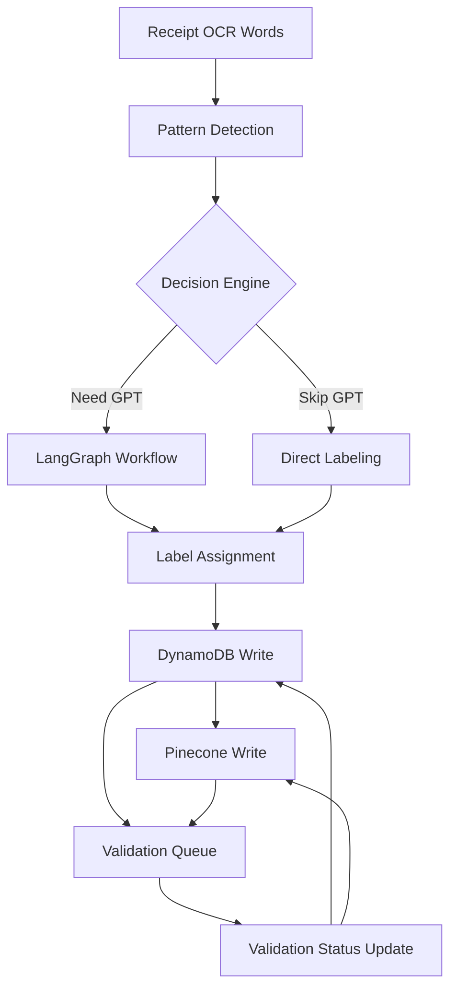

# Phase 3: Data Consistency Architecture

## Overview

Phase 3 introduces complex data flows between multiple systems. This document defines how we maintain consistency between DynamoDB (source of truth) and Pinecone (vector search).

## Data Flow Architecture



## Data Models

### 1. DynamoDB Schema

```python
# Primary Label Entity
ReceiptWordLabel:
    pk: "LABEL#{receipt_id}#{word_id}"
    sk: "VERSION#{timestamp}"
    label_type: str  # MERCHANT_NAME, PRODUCT_NAME, GRAND_TOTAL, etc.
    confidence: float
    source: str  # "pattern", "gpt", "manual"
    validation_status: str  # "pending", "validated", "failed"
    validation_errors: List[str]
    created_at: str
    updated_at: str
    created_by: str  # "phase3_langgraph", "manual_review", etc.

# Merchant Metadata
MerchantMetadata:
    pk: "MERCHANT#{normalized_name}"
    sk: "METADATA"
    display_name: str
    common_patterns: List[str]
    common_products: List[str]
    validation_rules: Dict[str, Any]
    last_updated: str

# Sync Status Tracking
SyncStatus:
    pk: "SYNC_NEEDED#{receipt_id}"
    sk: "PINECONE"
    reason: str
    retry_count: int
    created_at: str
    ttl: int  # Auto-expire after 24 hours
```

### 2. Pinecone Metadata Schema

```python
# Word Vector Metadata
{
    # Identity (immutable)
    "image_id": str,
    "receipt_id": str,
    "line_id": int,
    "word_id": int,
    
    # Text Data
    "text": str,
    "normalized_text": str,
    
    # Spatial Data
    "x": float,
    "y": float,
    "width": float,
    "height": float,
    "line_number": int,
    
    # Labels (mutable)
    "labels": str,  # JSON string: [{"type": "PRODUCT_NAME", "confidence": 0.95}]
    "label_source": str,  # "pattern", "gpt", "manual"
    "label_timestamp": str,
    "validation_status": str,  # "pending", "validated", "failed"
    "validation_errors": str,  # Comma-separated
    
    # Context
    "merchant_name": str,
    "merchant_confidence": float
}
```

## Consistency Rules

### 1. Write Operations

```python
class ConsistencyRules:
    """Define consistency rules between systems"""
    
    @staticmethod
    def validate_before_write(label_data: Dict) -> List[str]:
        """Validate data before writing to either system"""
        errors = []
        
        # Required fields
        if not label_data.get("label_type"):
            errors.append("label_type is required")
        
        # Confidence range
        confidence = label_data.get("confidence", 0)
        if not 0 <= confidence <= 1:
            errors.append(f"confidence {confidence} not in range [0,1]")
        
        # Valid label types
        valid_types = {
            "MERCHANT_NAME", "DATE", "TIME", "GRAND_TOTAL",
            "SUBTOTAL", "TAX", "PRODUCT_NAME", "PRODUCT_PRICE",
            "PRODUCT_QUANTITY", "DISCOUNT", "PAYMENT_METHOD"
        }
        if label_data.get("label_type") not in valid_types:
            errors.append(f"Invalid label_type: {label_data.get('label_type')}")
        
        return errors
```

### 2. Transaction Pattern

```python
async def store_labels_transactional(
    receipt_id: str,
    labels: Dict[int, LabelData]
) -> TransactionResult:
    """
    Two-phase commit pattern for consistency
    
    Phase 1: Write to DynamoDB (source of truth)
    Phase 2: Write to Pinecone (eventually consistent)
    """
    
    # Phase 1: DynamoDB
    try:
        dynamo_batch = []
        for word_id, label in labels.items():
            # Validate
            errors = ConsistencyRules.validate_before_write(label)
            if errors:
                return TransactionResult(
                    success=False,
                    phase="validation",
                    errors=errors
                )
            
            # Prepare write
            dynamo_batch.append(
                ReceiptWordLabel(
                    receipt_id=receipt_id,
                    word_id=word_id,
                    **label
                )
            )
        
        # Batch write to DynamoDB
        await dynamo_client.batch_write(dynamo_batch)
        
    except Exception as e:
        return TransactionResult(
            success=False,
            phase="dynamo_write",
            errors=[str(e)]
        )
    
    # Phase 2: Pinecone (best effort)
    try:
        await pinecone_store.update_labels(receipt_id, labels)
    except Exception as e:
        # Don't fail transaction, mark for retry
        await mark_for_sync(receipt_id, reason=str(e))
        logger.warning(f"Pinecone sync failed for {receipt_id}: {e}")
    
    return TransactionResult(success=True)
```

### 3. Read Operations

```python
class ConsistentReader:
    """Ensure consistent reads across systems"""
    
    async def get_receipt_labels(
        self,
        receipt_id: str,
        include_validation: bool = True
    ) -> Dict[int, LabelInfo]:
        """
        Always read from DynamoDB as source of truth.
        Pinecone is only used for similarity search.
        """
        
        # Get labels from DynamoDB
        labels = await dynamo_client.query_labels(receipt_id)
        
        # Optionally check Pinecone sync status
        if include_validation:
            sync_status = await check_sync_status(receipt_id)
            if sync_status.needs_sync:
                logger.warning(
                    f"Receipt {receipt_id} has pending Pinecone sync"
                )
        
        return labels
```

## Sync Management

### 1. Background Sync Process

```python
class PineconeSyncManager:
    """Manage eventual consistency with Pinecone"""
    
    async def sync_pending_receipts(self):
        """Run periodically to sync failed Pinecone writes"""
        
        # Query for receipts needing sync
        pending = await dynamo_client.query(
            KeyConditionExpression="pk = :pk",
            ExpressionAttributeValues={
                ":pk": "SYNC_NEEDED#"
            }
        )
        
        for item in pending:
            receipt_id = item["pk"].split("#")[1]
            
            try:
                # Get current labels from DynamoDB
                labels = await dynamo_client.get_receipt_labels(receipt_id)
                
                # Update Pinecone
                await pinecone_store.sync_labels(receipt_id, labels)
                
                # Remove sync marker
                await dynamo_client.delete_item(item["pk"], item["sk"])
                
            except Exception as e:
                # Increment retry count
                item["retry_count"] = item.get("retry_count", 0) + 1
                
                if item["retry_count"] > MAX_RETRIES:
                    # Alert for manual intervention
                    await alert_sync_failure(receipt_id, e)
                else:
                    # Update retry count
                    await dynamo_client.update_item(item)
```

### 2. Monitoring

```python
class ConsistencyMonitor:
    """Monitor data consistency between systems"""
    
    async def check_consistency(self, sample_size: int = 100):
        """Randomly sample receipts to verify consistency"""
        
        results = {
            "consistent": 0,
            "inconsistent": 0,
            "missing_in_pinecone": 0
        }
        
        # Random sample of receipts
        receipts = await dynamo_client.sample_receipts(sample_size)
        
        for receipt in receipts:
            dynamo_labels = await dynamo_client.get_labels(receipt.id)
            pinecone_data = await pinecone_store.get_metadata(receipt.id)
            
            if not pinecone_data:
                results["missing_in_pinecone"] += 1
            elif self._compare_labels(dynamo_labels, pinecone_data):
                results["consistent"] += 1
            else:
                results["inconsistent"] += 1
                await self._log_inconsistency(receipt.id, dynamo_labels, pinecone_data)
        
        return results
```

## Error Recovery

### 1. Rollback Strategy

```python
class TransactionRollback:
    """Handle failed transactions"""
    
    async def rollback_labels(
        self,
        receipt_id: str,
        transaction_id: str
    ):
        """Rollback a failed label transaction"""
        
        # Get transaction log
        tx_log = await dynamo_client.get_transaction_log(transaction_id)
        
        if tx_log.phase == "dynamo_write":
            # Rollback DynamoDB writes
            for operation in tx_log.operations:
                await dynamo_client.delete_item(
                    operation["pk"],
                    operation["sk"]
                )
        
        elif tx_log.phase == "pinecone_write":
            # DynamoDB succeeded, Pinecone failed
            # Mark for manual sync rather than rollback
            await mark_for_sync(receipt_id, priority="high")
```

### 2. Manual Intervention

```python
class ManualReconciliation:
    """Tools for manual data reconciliation"""
    
    async def force_sync_receipt(self, receipt_id: str):
        """Force sync a specific receipt from DynamoDB to Pinecone"""
        
        # Get all data from DynamoDB
        labels = await dynamo_client.get_all_labels(receipt_id)
        words = await dynamo_client.get_receipt_words(receipt_id)
        
        # Clear Pinecone data
        await pinecone_store.delete_receipt_vectors(receipt_id)
        
        # Rebuild Pinecone data
        embeddings = await generate_embeddings(words)
        await pinecone_store.store_labeled_words(
            receipt_id,
            words,
            embeddings,
            labels
        )
        
        # Verify
        return await self.verify_sync(receipt_id)
```

## Best Practices

### 1. Always Write to DynamoDB First
- DynamoDB is the source of truth
- Pinecone is for search optimization only
- Never write to Pinecone without DynamoDB

### 2. Handle Pinecone Failures Gracefully
- Log failures but don't block operations
- Use async sync process for recovery
- Monitor sync lag metrics

### 3. Validate Before Writing
- Consistent validation rules
- Prevent bad data from entering either system
- Use typed models (dataclasses)

### 4. Use Batch Operations
- Batch DynamoDB writes (25 items max)
- Batch Pinecone upserts (100 vectors)
- Reduce API calls and improve performance

### 5. Monitor Consistency
- Regular consistency checks
- Alert on sync failures
- Track sync lag time

## Testing Strategy

### 1. Unit Tests
```python
def test_label_validation():
    """Test validation rules"""
    assert ConsistencyRules.validate_before_write({
        "label_type": "INVALID_TYPE",
        "confidence": 1.5
    }) == [
        "Invalid label_type: INVALID_TYPE",
        "confidence 1.5 not in range [0,1]"
    ]
```

### 2. Integration Tests
```python
async def test_transaction_rollback():
    """Test rollback on Pinecone failure"""
    # Mock Pinecone to fail
    with mock.patch("pinecone_store.update_labels", side_effect=Exception):
        result = await store_labels_transactional(
            "test_receipt",
            {1: {"label_type": "PRODUCT_NAME", "confidence": 0.9}}
        )
        
        # Should succeed (DynamoDB write succeeded)
        assert result.success
        
        # Should be marked for sync
        sync_status = await get_sync_status("test_receipt")
        assert sync_status.needs_sync
```

### 3. Consistency Tests
```python
async def test_eventual_consistency():
    """Test that sync process achieves consistency"""
    # Create inconsistency
    await dynamo_client.put_label(test_label)
    # Don't write to Pinecone
    
    # Run sync
    await sync_manager.sync_pending_receipts()
    
    # Verify consistency
    dynamo_data = await dynamo_client.get_label(test_label.id)
    pinecone_data = await pinecone_store.get_metadata(test_label.id)
    
    assert compare_labels(dynamo_data, pinecone_data)
```

## Conclusion

This architecture ensures:
1. **DynamoDB as source of truth** - All reads for entity data come from DynamoDB
2. **Pinecone for search** - Vector similarity and metadata filtering only
3. **Eventual consistency** - Pinecone syncs asynchronously without blocking
4. **Graceful degradation** - System works even if Pinecone is temporarily unavailable
5. **Audit trail** - All changes tracked in DynamoDB with versions