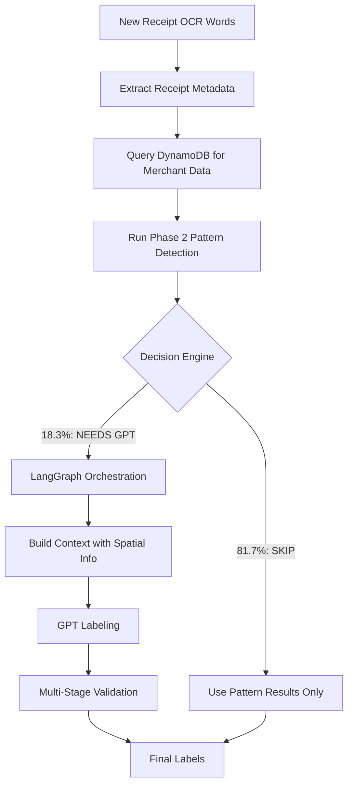

# Phase 3: LangGraph Integration Plan

## Current State (What Phase 2 Accomplished)

### Phase 2 Delivered:
- **81.7% cost reduction** through spatial/mathematical detection
- **Currency column detection** - identifies vertically aligned prices
- **Mathematical validation** - finds relationships between values (items + tax = total)
- **Pattern detection** - dates, times, merchant names, currency values
- **Decision Engine** - determines SKIP/BATCH/REQUIRED for GPT calls

### What Phase 2 Did NOT Do:
- **No line item descriptions** - only found currency values in columns
- **No product matching** - prices are identified but not linked to product names
- **No cross-line association** - currency on line 5 not linked to text on line 5

## Phase 3 Goals

1. **Fill the gaps** - Use GPT selectively to label what patterns missed
2. **Context-aware labeling** - Provide spatial relationships to GPT
3. **Multi-stage validation** - Ensure mathematical and semantic consistency
4. **Cost efficiency** - Only call GPT for the 18.3% that need it

## Accurate Receipt Processing Flow



## LangGraph Integration Architecture

### 1. State Definition
```python
from typing import TypedDict, List, Dict, Optional

class ReceiptProcessingState(TypedDict):
    # Input data
    receipt_words: List[ReceiptWord]
    receipt_metadata: Dict  # From DynamoDB
    merchant_data: Optional[Dict]  # From DynamoDB merchant lookup
    
    # Phase 2 results
    pattern_results: Dict  # All pattern matches
    currency_columns: List[PriceColumn]  # Spatial detection results
    math_solutions: List[Dict]  # Mathematical relationships
    decision_outcome: str  # SKIP/BATCH/REQUIRED
    
    # Phase 3 processing
    missing_labels: List[str]  # What patterns didn't find
    gpt_prompt: str  # Context-aware prompt
    gpt_response: Dict  # Raw GPT output
    extracted_labels: Dict  # Parsed labels from GPT
    
    # Validation
    validation_results: Dict
    retry_count: int
    final_labels: Dict
```

### 2. Key LangGraph Nodes

#### Node 1: Merchant Lookup
```python
async def merchant_lookup_node(state: ReceiptProcessingState) -> ReceiptProcessingState:
    """First step: Query DynamoDB for merchant data"""
    
    # Extract merchant name from receipt metadata or pattern results
    merchant_name = extract_merchant_name(state["receipt_metadata"])
    
    # Query DynamoDB for merchant-specific patterns and metadata
    merchant_data = await query_merchant_data(merchant_name)
    
    state["merchant_data"] = merchant_data
    return state
```

#### Node 2: Gap Analysis
```python
async def gap_analysis_node(state: ReceiptProcessingState) -> ReceiptProcessingState:
    """Identify what Phase 2 patterns missed"""
    
    # Essential labels we need
    required_labels = ["MERCHANT_NAME", "DATE", "GRAND_TOTAL"]
    
    # What patterns found
    found_labels = extract_found_labels(state["pattern_results"])
    
    # Special case: We have prices but no product descriptions
    has_orphan_prices = (
        len(state["currency_columns"]) > 0 and
        "PRODUCT_NAME" not in found_labels
    )
    
    missing = []
    if has_orphan_prices:
        missing.append("PRODUCT_DESCRIPTIONS_FOR_PRICES")
    
    missing.extend([l for l in required_labels if l not in found_labels])
    
    state["missing_labels"] = missing
    return state
```

#### Node 3: Context-Aware Prompt Building
```python
async def build_gpt_prompt_node(state: ReceiptProcessingState) -> ReceiptProcessingState:
    """Build comprehensive prompt with spatial context"""
    
    prompt = f"""
    You are analyzing a receipt from {state['merchant_data'].get('name', 'Unknown Merchant')}.
    
    MERCHANT CONTEXT:
    - Known patterns: {state['merchant_data'].get('patterns', [])}
    - Typical products: {state['merchant_data'].get('common_products', [])}
    
    SPATIAL LAYOUT:
    The receipt has currency values in a column at X≈{get_column_x_position(state['currency_columns'])}.
    
    CURRENCY VALUES FOUND:
    {format_currency_with_line_numbers(state['currency_columns'])}
    
    MATHEMATICAL RELATIONSHIPS:
    {format_math_solutions(state['math_solutions'])}
    
    YOUR TASK:
    1. For each currency value listed above, identify the product name from the same line
    2. Label any missing essential fields: {state['missing_labels']}
    3. Use the mathematical relationships to validate your answers
    
    IMPORTANT: 
    - Product names are typically LEFT of the price on the same line
    - The last/largest price is usually the GRAND_TOTAL
    - Look for tax amounts near the total
    
    Receipt text by line:
    {format_receipt_lines_with_coordinates(state['receipt_words'])}
    """
    
    state["gpt_prompt"] = prompt
    return state
```

#### Node 4: Validation Node
```python
async def validation_node(state: ReceiptProcessingState) -> ReceiptProcessingState:
    """Multi-stage validation of combined labels"""
    
    # Merge pattern labels with GPT labels
    all_labels = merge_labels(
        state["pattern_results"],
        state["extracted_labels"]
    )
    
    validations = {
        "mathematical": validate_math_consistency(all_labels, state["math_solutions"]),
        "merchant": validate_against_merchant_data(all_labels, state["merchant_data"]),
        "spatial": validate_spatial_relationships(all_labels, state["currency_columns"]),
        "completeness": validate_essential_fields_present(all_labels)
    }
    
    state["validation_results"] = validations
    state["final_labels"] = all_labels if all(validations.values()) else {}
    
    return state
```

### 3. Workflow Definition
```python
def create_phase3_workflow():
    workflow = StateGraph(ReceiptProcessingState)
    
    # Add all nodes
    workflow.add_node("merchant_lookup", merchant_lookup_node)
    workflow.add_node("gap_analysis", gap_analysis_node)
    workflow.add_node("build_prompt", build_gpt_prompt_node)
    workflow.add_node("call_gpt", gpt_labeling_node)
    workflow.add_node("parse_response", parse_gpt_response_node)
    workflow.add_node("validate", validation_node)
    workflow.add_node("finalize", finalize_labels_node)
    
    # Define flow
    workflow.set_entry_point("merchant_lookup")
    workflow.add_edge("merchant_lookup", "gap_analysis")
    
    # Conditional: Do we need GPT?
    workflow.add_conditional_edges(
        "gap_analysis",
        lambda x: "finalize" if not x["missing_labels"] else "build_prompt"
    )
    
    workflow.add_edge("build_prompt", "call_gpt")
    workflow.add_edge("call_gpt", "parse_response")
    workflow.add_edge("parse_response", "validate")
    
    # Conditional: Did validation pass?
    workflow.add_conditional_edges(
        "validate",
        lambda x: "finalize" if all(x["validation_results"].values()) else "build_prompt",
        {
            "finalize": "finalize",
            "build_prompt": "build_prompt"  # Retry with better context
        }
    )
    
    workflow.add_edge("finalize", END)
    
    return workflow.compile()
```

## Key Implementation Tasks

### 1. DynamoDB Integration
- [ ] Create merchant data access layer
- [ ] Implement caching for frequently accessed merchants
- [ ] Add merchant pattern storage structure

### 2. Spatial Context Builder
- [ ] Function to extract text from same line as currency values
- [ ] Line-by-line receipt formatter with coordinates
- [ ] Spatial relationship describer for GPT context

### 3. GPT Integration
- [ ] Batch API integration for cost savings
- [ ] Response parser for structured output
- [ ] Error handling and retry logic

### 4. Validation Engine
- [ ] Mathematical consistency checker
- [ ] Merchant-specific validation rules
- [ ] Confidence score calculator

### 5. Testing Framework
- [ ] Mock LangGraph workflow for unit tests
- [ ] Integration tests with real receipts
- [ ] Cost tracking for GPT calls

## Success Metrics

1. **Cost Reduction**: Maintain <20% GPT call rate
2. **Accuracy**: >95% labeling accuracy on test set
3. **Performance**: <500ms for pattern-only, <3s with GPT
4. **Line Item Matching**: >90% success rate linking prices to products

## Next Steps

1. Set up LangGraph dependencies
2. Create DynamoDB merchant data schema
3. Implement spatial context extraction utilities
4. Build the core workflow with proper error handling
5. Create comprehensive test suite with cost tracking