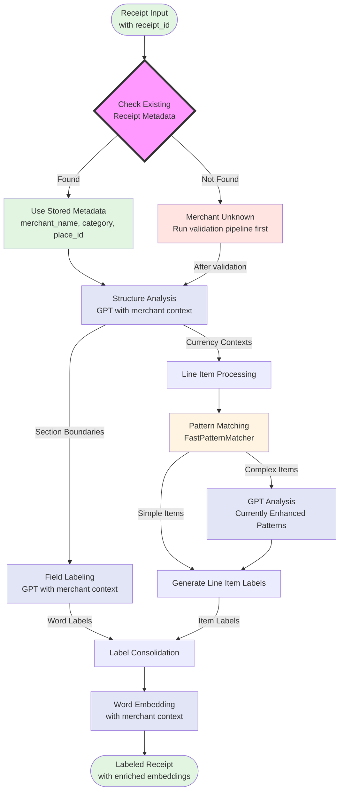

# Receipt Label

A Python package for labeling and validating receipt data using GPT and Pinecone.

## Receipt Word Labeling Flow

The receipt labeling process leverages existing merchant metadata from our validation pipeline:



**Note**: The merchant validation pipeline (Step Functions) runs after OCR and before labeling to ensure merchant metadata is available. This metadata enriches both the GPT prompts and word embeddings.

### Detailed Labeling Process

#### 1. **Receipt Ingestion & Metadata Lookup**
- Entry point: `ReceiptLabeler.label_receipt()`
- Input: Receipt with OCR-extracted words and lines
- First step: Query existing `ReceiptMetadata` by receipt_id
- If metadata exists: Use stored merchant_name, category, place_id
- If no metadata: Receipt must go through merchant validation pipeline first

#### 2. **Structure Analysis**
- Method: `ReceiptAnalyzer.analyze_structure()`
- Uses GPT to identify receipt sections:
  - **Header**: Business name, address, phone, date/time
  - **Body**: Line items, quantities, prices
  - **Footer**: Totals, payment info, thank you message
- **Enhanced with merchant context**: GPT receives merchant_name and category to better understand receipt structure
- Returns section boundaries for targeted labeling

#### 3. **Field Labeling**
- Method: `ReceiptAnalyzer.label_fields()`
- Processes each section with GPT
- **Merchant-aware labeling**: Uses merchant category to improve accuracy (e.g., "BURGER" at McDonald's vs hardware store)
- Labels include:
  - `MERCHANT_NAME`, `ADDRESS_LINE`, `PHONE_NUMBER`
  - `DATE`, `TIME`, `PAYMENT_METHOD`
  - `PRODUCT_NAME`, `QUANTITY`, `UNIT_PRICE`
  - `SUBTOTAL`, `TAX`, `GRAND_TOTAL`
- Returns confidence scores and review flags

#### 4. **Line Item Processing**
- Method: `LineItemProcessor.analyze_line_items()`
- Two-stage approach:

  a. **Pattern Matching** (`FastPatternMatcher`):
  - Currency patterns: `$12.99`, `$1,234.56`
  - Quantity patterns: `2 @ $5.99`, `Qty: 3 x $4.50`
  - Financial fields: Subtotal, Tax, Total, Discount

  b. **Enhanced Analysis**:
  - Currently uses `EnhancedCurrencyAnalyzer` for 80-85% accuracy
  - Planned: Pinecone lookups for edge cases (Week 2)

#### 5. **Label Consolidation**
- Merges field labels with line item labels
- Priority system (1-9 scale):
  - Financial totals: Priority 9
  - Line item components: Priority 8
  - Transaction details: Priority 6
  - Business info: Priority 5
- Higher priority labels override lower ones

#### 6. **Validation** (Optional)
- Checks mathematical consistency
- Validates required fields presence
- Flags discrepancies for review

### Label Categories

| Category | Labels | Priority |
|----------|--------|----------|
| **Financial Totals** | `SUBTOTAL`, `TAX`, `GRAND_TOTAL` | 9 |
| **Line Items** | `ITEM_NAME`, `ITEM_QUANTITY`, `ITEM_PRICE`, `ITEM_TOTAL` | 8 |
| **Transaction** | `DATE`, `TIME`, `PAYMENT_METHOD`, `DISCOUNT` | 6 |
| **Business Info** | `MERCHANT_NAME`, `ADDRESS_LINE`, `PHONE_NUMBER` | 5 |
| **Other** | `COUPON`, `LOYALTY_ID`, `WEBSITE` | 1-4 |

### Pattern Matching Details

The `FastPatternMatcher` and `EnhancedCurrencyAnalyzer` detect:

- **Currency Formats**: `$5.99`, `5.99`, `$1,234.56`
- **Quantity Patterns**:
  - At symbol: `2 @ $5.99`
  - Multiplication: `3 x $4.50`, `Qty: 3 x $4.50`
  - Slash notation: `2/$10.00`
  - For pricing: `3 for $15.00`
  - With units: `2 items @ $5.99`
- **Financial Keywords**:
  - Subtotal: "subtotal", "sub total", "net total", "merchandise"
  - Tax: "tax", "sales tax", "vat", "gst", "hst"
  - Total: "total", "grand total", "amount due", "balance due"
  - Discount: "discount", "coupon", "savings", "% off"

### Integration with AI Services

- **GPT-4**: Structure analysis, field labeling, complex line items
- **Pattern Matching**: Fast local processing for common formats
- **Pinecone** (Planned): Semantic search for edge cases and validation

### Merchant Metadata Integration

The system leverages existing merchant validation pipelines:

1. **Merchant Validation Pipeline** (Step Functions):
   - Runs after OCR, before labeling
   - Validates merchant using Google Places API
   - Normalizes data with OpenAI
   - Stores as `ReceiptMetadata` entity in DynamoDB

2. **Metadata Usage in Labeling**:
   - Query by receipt_id to get merchant context
   - Include merchant_name and category in GPT prompts
   - Enrich word embeddings with merchant information
   - Example: "BURGER [label=PRODUCT_NAME] (merchant=McDonald's, category=restaurant)"

3. **Benefits**:
   - More accurate labeling (merchant context disambiguates items)
   - Richer embeddings for better semantic search
   - No additional API calls needed
   - Leverages already-validated merchant data

## Package Responsibilities

**IMPORTANT**: This package handles business logic and AI integrations. It must NOT contain DynamoDB-specific code.

### What belongs in receipt_label:
- ✅ Receipt labeling and analysis logic
- ✅ AI service integrations (OpenAI, Anthropic)
- ✅ Pinecone vector database operations
- ✅ Google Places API integration
- ✅ Label validation and correction logic

### What does NOT belong here:
- ❌ Direct DynamoDB operations (use receipt_dynamo interfaces)
- ❌ DynamoDB retry logic or resilience patterns (use ResilientDynamoClient from receipt_dynamo)
- ❌ DynamoDB batch processing logic (use receipt_dynamo's batch methods)
- ❌ OCR text extraction (belongs in receipt_ocr)

### Example: Proper DynamoDB Usage
```python
# ✅ CORRECT: Use receipt_dynamo's high-level interfaces
from receipt_dynamo import ResilientDynamoClient

client = ResilientDynamoClient(table_name="my-table")
client.put_ai_usage_metric(metric)  # Let receipt_dynamo handle resilience

# ❌ WRONG: Don't implement DynamoDB logic here
def put_with_retry(item):
    for attempt in range(3):  # This belongs in receipt_dynamo!
        try:
            dynamo.put_item(...)
        except:
            time.sleep(2 ** attempt)
```

## Embedding Strategy

For each receipt word, we generate two embeddings to capture both semantic and spatial context:

1. **Word-level embedding**

   - Text: `<word> [label=ITEM_NAME] (pos=top-left)`
   - Captures the token’s semantic content and its key attributes in a single vector.

2. **Context-level embedding**
   - Text: the concatenated words with similar Y-position (using `get_hybrid_context`)
   - Captures layout and neighboring-word relationships to provide visual context.

**Purpose:**

- The dual embeddings enrich prompts by retrieving both token-level and line-level examples from Pinecone.
- Semantic neighbors (word view) help validate the token’s meaning in isolation.
- Context neighbors (context view) help validate how the token is used in layout (e.g., line items, addresses).

**Metadata Updates:**

- On the **valid** path: update each embedding’s metadata with `status: VALID`.
- On the **invalid** path: update metadata with `status: INVALID` and add `proposed_label: <new_label>`.
- We reuse the same vector IDs so we never duplicate embeddings—only metadata changes.

This approach allows agentic, data‑driven validation and label proposal, while keeping Pinecone storage efficient and easy to query.

## Label Validation Strategy

## 🧪 Label Validation Strategy

This project uses a layered, multi-pass approach to label validation in order to combine efficiency, semantic similarity, and multi-hop reasoning.

### 🔹 Pass 1: Batch Label Validation with GPT

All `ReceiptWordLabel` entries are processed via batch completions using OpenAI’s function calling. GPT evaluates each label in context and flags whether it is valid. If the label is deemed incorrect, it may suggest a corrected label and provide a rationale. This step is fully parallelizable using the OpenAI Batch API.

### 🔹 Pass 2: Embedding-Based Refinement

For any labels marked as invalid in the first pass, a second evaluation is conducted using Pinecone. The model is provided with:

- The word and its receipt context
- The original and GPT-suggested labels
- A list of nearby Pinecone embeddings with known correct labels

GPT uses this expanded semantic context to reconsider its earlier assessment. This step improves precision on edge cases like numbers, prepositions, or ambiguous merchant terms.

## 🔹 Pass 3: Agentic Label Resolution

The final pass uses the OpenAI Agents SDK to resolve remaining ambiguous or inconsistent labels. The agent can:

- Call Pinecone to compare embeddings across receipts
- Query DynamoDB for past receipt structure
- Apply logical rules (e.g., label propagation across lines)
- Chain multiple reasoning steps before finalizing a label

## AI Usage Tracking

This package includes comprehensive AI usage tracking with context manager patterns for automatic cost monitoring.

### Context Manager Patterns

```python
from receipt_label.utils import ai_usage_context, ai_usage_tracked

# Decorator for automatic tracking
@ai_usage_tracked(operation_type="receipt_processing")
def process_receipt(receipt_id: str):
    # Function is automatically tracked
    result = openai_client.chat.completions.create(...)
    return result

# Context manager for complex operations
with ai_usage_context("batch_processing", job_id="job-123") as tracker:
    for receipt in receipts:
        process_receipt(receipt)
    # Metrics automatically flushed
```

### Features

- **Automatic tracking** via decorators
- **Context propagation** across function calls
- **Error recovery** - metrics flushed even on exceptions
- **Partial failure handling** for batch operations
- **Thread-safe** concurrent operations
- **< 5ms overhead** per operation

See [Context Manager Documentation](docs/context_managers.md) for detailed usage.

This stage is ideal for advanced logic, correction propagation, and multi-hop validation workflows.
