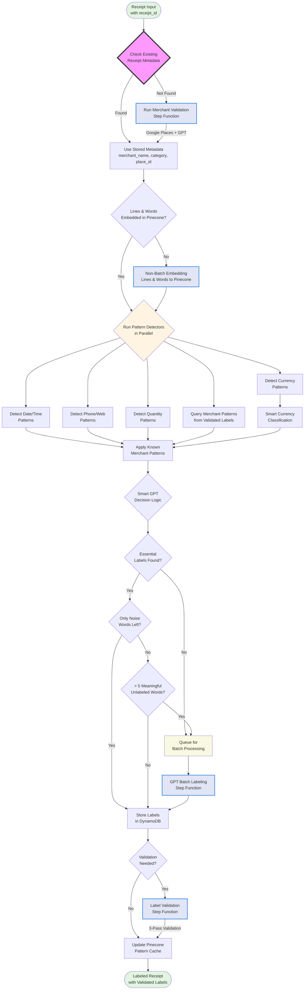

# Receipt Label

A Python package for labeling and validating receipt data using GPT and Pinecone.

## Receipt Word Labeling Flow

The receipt labeling process integrates with existing Step Functions and follows an efficient, parallel approach:



**Key Components**:
- **Step Functions**: Leverages existing merchant validation, batch embedding, and label validation pipelines
- **Parallel Detection**: Pattern detectors run simultaneously for efficiency
- **Smart Batching**: Queue unlabeled words for OpenAI batch API (50% cost reduction)
- **Validation Pipeline**: Optional 3-pass validation for high-accuracy requirements

### Detailed Labeling Process

#### 1. **Receipt Ingestion & Metadata Lookup**
- Entry point: `ReceiptLabeler.label_receipt()`
- Input: Receipt with OCR-extracted words and lines
- First step: Query existing `ReceiptMetadata` by receipt_id from DynamoDB
- If metadata exists: Use stored merchant_name, category, place_id
- If no metadata: Receipt must go through merchant validation pipeline first

#### 2. **Pinecone Embedding Check**
- Check if receipt lines and words are already embedded in Pinecone
- If not embedded: Generate embeddings for all lines and words
- Store embeddings with metadata including receipt_id and merchant info
- This ensures all text is searchable for pattern matching

#### 3. **Parallel Pattern Detection**
Run these detectors simultaneously for efficiency:
- **Currency Detection**: Find all monetary amounts using regex patterns
- **DateTime Detection**: Identify dates and times in various formats
- **Contact Detection**: Find phone numbers, websites, email addresses
- **Quantity Detection**: Identify quantity patterns (2 @, Qty:, x3, etc.)
- **Single Pinecone Query**: Retrieve labeling patterns from similar merchant receipts

#### 4. **Smart Currency Classification**
Currency amounts are classified based on:
- **Position**: Bottom 20% likely totals, middle section likely line items
- **Keywords**: Nearby text like "total", "tax", "subtotal"
- **Context**: Quantity patterns indicate unit price vs line total
- **Rules**:
  - Near "total/balance due" → `GRAND_TOTAL`
  - Near "tax/vat/gst" → `TAX`
  - Near "subtotal" → `SUBTOTAL`
  - Has quantity before → `UNIT_PRICE` or `LINE_TOTAL`

#### 5. **Apply Merchant-Specific Patterns**
Using patterns from the single Pinecone query:
- Apply known word→label mappings for this merchant
- Example patterns:
  - McDonald's: "Big Mac" → `PRODUCT_NAME`
  - Home Depot: "SKU" → `PRODUCT_NAME`
  - Common: "VISA ****1234" → `PAYMENT_METHOD`
- Confidence based on pattern frequency across receipts

#### 6. **Smart GPT Decision & Batch Labeling**
Not every word needs labeling, and not every receipt needs GPT:

**Essential Labels** (must be found):
- `MERCHANT_NAME` - Need to know where purchase was made
- `DATE` - Need transaction date
- `GRAND_TOTAL` - Need final amount
- `PRODUCT_NAME` - Need at least one item

**Decision Logic**:
1. **Check Essential Labels**: If missing any essential label, call GPT to find them
2. **Filter Noise Words**: Skip punctuation, separators, single characters
3. **Apply Threshold**: If < 5 meaningful unlabeled words remain, skip GPT
4. **Batch Remaining**: Group by line and make single GPT call

**Noise Word Examples**:
- Punctuation: `.`, `,`, `:`, `-`
- Separators: `---`, `===`, `***`
- Receipt artifacts: Torn edges, scan noise
- Single characters (except `$`, `€`, etc.)

#### 7. **Store Results and Update Patterns**
- Store all word labels in DynamoDB as `ReceiptWordLabel` entities
- Update Pinecone with new successful patterns for future use
- Track pattern confidence for continuous improvement

### Noise Word Handling Strategy

#### Storage Approach
- **DynamoDB**: Store ALL words including noise (complete OCR preservation)
- **Pinecone**: Embed only meaningful words (efficient semantic search)
- **Labeling**: Skip noise words entirely (no CORE_LABELS assigned)

#### Noise Word Identification
Words are marked as noise if they are:
- Single punctuation characters (`.`, `,`, `:`)
- Separators (`---`, `===`, `***`)
- OCR artifacts (scan noise, torn edges)
- Pure non-alphanumeric strings

#### Implementation
```python
# During processing
for word in receipt_words:
    if is_noise_word(word.text):
        word.is_noise = True  # Mark in DynamoDB
        continue  # Skip embedding and labeling

    # Process meaningful words only
    embed_word(word)
    label_word(word)
```

### Efficient Labeling Implementation

#### Pattern Detection Functions
```python
async def label_receipt_efficiently(receipt_id: str, words: List[ReceiptWord]):
    # Step 1: Get merchant context
    metadata = await get_receipt_metadata(receipt_id)

    # Step 2: Run all detectors in parallel
    results = await asyncio.gather(
        detect_currency_patterns(words),
        detect_datetime_patterns(words),
        detect_contact_patterns(words),
        detect_quantity_patterns(words),
        query_merchant_patterns(metadata.merchant_name)
    )

    # Step 3: Apply smart classification
    labeled_words = apply_pattern_rules(words, results)

    # Step 4: Batch label remaining
    unlabeled = [w for w in words if not w.label]
    if unlabeled:
        labels = await batch_gpt_label(unlabeled, labeled_words, metadata)
        apply_labels(unlabeled, labels)

    # Step 5: Store and learn
    await store_labels(receipt_id, words)
    await update_pattern_cache(metadata.merchant_name, words)
```

#### Cost Comparison
| Approach | Pinecone Queries | GPT Calls | Processing Time |
|----------|------------------|-----------|-----------------|
| **Old (Per-Word)** | N words | N words | O(N) sequential |
| **New (Efficient)** | 1 query | 1 batch call | O(1) parallel |
| **Savings** | ~99% reduction | ~95% reduction | ~80% faster |

### Label Categories (CORE_LABELS)

Using the predefined corpus from `constants.py`:

| Category | Labels | Description |
|----------|--------|-------------|
| **Financial Totals** | `SUBTOTAL`, `TAX`, `GRAND_TOTAL` | Bottom section amounts |
| **Line Items** | `PRODUCT_NAME`, `QUANTITY`, `UNIT_PRICE`, `LINE_TOTAL` | Item details |
| **Transaction** | `DATE`, `TIME`, `PAYMENT_METHOD`, `DISCOUNT`, `COUPON` | Transaction metadata |
| **Business Info** | `MERCHANT_NAME`, `ADDRESS_LINE`, `PHONE_NUMBER`, `WEBSITE` | Store information |
| **Customer Info** | `LOYALTY_ID` | Customer identifiers |

### Pattern Matching Details

The `FastPatternMatcher` and `EnhancedCurrencyAnalyzer` detect:

- **Currency Formats**: `$5.99`, `5.99`, `$1,234.56`
- **Quantity Patterns**:
  - At symbol: `2 @ $5.99`
  - Multiplication: `3 x $4.50`, `Qty: 3 x $4.50`
  - Slash notation: `2/$10.00`
  - For pricing: `3 for $15.00`
  - With units: `2 items @ $5.99`
- **Financial Keywords**:
  - Subtotal: "subtotal", "sub total", "net total", "merchandise"
  - Tax: "tax", "sales tax", "vat", "gst", "hst"
  - Total: "total", "grand total", "amount due", "balance due"
  - Discount: "discount", "coupon", "savings", "% off"

### Integration with AI Services

- **GPT-4**: Structure analysis, field labeling, complex line items
- **Pattern Matching**: Fast local processing for common formats
- **Pinecone** (Planned): Semantic search for edge cases and validation

### Merchant Metadata Integration

The system leverages existing merchant validation pipelines:

1. **Merchant Validation Pipeline** (Step Functions):
   - Runs after OCR, before labeling
   - Validates merchant using Google Places API
   - Normalizes data with OpenAI
   - Stores as `ReceiptMetadata` entity in DynamoDB

2. **Metadata Usage in Labeling**:
   - Query by receipt_id to get merchant context
   - Include merchant_name and category in GPT prompts
   - Enrich word embeddings with merchant information
   - Example: "BURGER [label=PRODUCT_NAME] (merchant=McDonald's, category=restaurant)"

3. **Benefits**:
   - More accurate labeling (merchant context disambiguates items)
   - Richer embeddings for better semantic search
   - No additional API calls needed
   - Leverages already-validated merchant data

## Package Responsibilities

**IMPORTANT**: This package handles business logic and AI integrations. It must NOT contain DynamoDB-specific code.

### What belongs in receipt_label:
- ✅ Receipt labeling and analysis logic
- ✅ AI service integrations (OpenAI, Anthropic)
- ✅ Pinecone vector database operations
- ✅ Google Places API integration
- ✅ Label validation and correction logic

### What does NOT belong here:
- ❌ Direct DynamoDB operations (use receipt_dynamo interfaces)
- ❌ DynamoDB retry logic or resilience patterns (use ResilientDynamoClient from receipt_dynamo)
- ❌ DynamoDB batch processing logic (use receipt_dynamo's batch methods)
- ❌ OCR text extraction (belongs in receipt_ocr)

### Example: Proper DynamoDB Usage
```python
# ✅ CORRECT: Use receipt_dynamo's high-level interfaces
from receipt_dynamo import ResilientDynamoClient

client = ResilientDynamoClient(table_name="my-table")
client.put_ai_usage_metric(metric)  # Let receipt_dynamo handle resilience

# ❌ WRONG: Don't implement DynamoDB logic here
def put_with_retry(item):
    for attempt in range(3):  # This belongs in receipt_dynamo!
        try:
            dynamo.put_item(...)
        except:
            time.sleep(2 ** attempt)
```

## Embedding Strategy

For each receipt word, we generate two embeddings to capture both semantic and spatial context:

1. **Word-level embedding**

   - Text: `<word> [label=ITEM_NAME] (pos=top-left)`
   - Captures the token’s semantic content and its key attributes in a single vector.

2. **Context-level embedding**
   - Text: the concatenated words with similar Y-position (using `get_hybrid_context`)
   - Captures layout and neighboring-word relationships to provide visual context.

**Purpose:**

- The dual embeddings enrich prompts by retrieving both token-level and line-level examples from Pinecone.
- Semantic neighbors (word view) help validate the token’s meaning in isolation.
- Context neighbors (context view) help validate how the token is used in layout (e.g., line items, addresses).

**Metadata Updates:**

- On the **valid** path: update each embedding’s metadata with `status: VALID`.
- On the **invalid** path: update metadata with `status: INVALID` and add `proposed_label: <new_label>`.
- We reuse the same vector IDs so we never duplicate embeddings—only metadata changes.

This approach allows agentic, data‑driven validation and label proposal, while keeping Pinecone storage efficient and easy to query.

## Label Validation Strategy

## 🧪 Label Validation Strategy

This project uses a layered, multi-pass approach to label validation in order to combine efficiency, semantic similarity, and multi-hop reasoning.

### 🔹 Pass 1: Batch Label Validation with GPT

All `ReceiptWordLabel` entries are processed via batch completions using OpenAI’s function calling. GPT evaluates each label in context and flags whether it is valid. If the label is deemed incorrect, it may suggest a corrected label and provide a rationale. This step is fully parallelizable using the OpenAI Batch API.

### 🔹 Pass 2: Embedding-Based Refinement

For any labels marked as invalid in the first pass, a second evaluation is conducted using Pinecone. The model is provided with:

- The word and its receipt context
- The original and GPT-suggested labels
- A list of nearby Pinecone embeddings with known correct labels

GPT uses this expanded semantic context to reconsider its earlier assessment. This step improves precision on edge cases like numbers, prepositions, or ambiguous merchant terms.

## 🔹 Pass 3: Agentic Label Resolution

The final pass uses the OpenAI Agents SDK to resolve remaining ambiguous or inconsistent labels. The agent can:

- Call Pinecone to compare embeddings across receipts
- Query DynamoDB for past receipt structure
- Apply logical rules (e.g., label propagation across lines)
- Chain multiple reasoning steps before finalizing a label

## AI Usage Tracking

This package includes comprehensive AI usage tracking with context manager patterns for automatic cost monitoring.

### Context Manager Patterns

```python
from receipt_label.utils import ai_usage_context, ai_usage_tracked

# Decorator for automatic tracking
@ai_usage_tracked(operation_type="receipt_processing")
def process_receipt(receipt_id: str):
    # Function is automatically tracked
    result = openai_client.chat.completions.create(...)
    return result

# Context manager for complex operations
with ai_usage_context("batch_processing", job_id="job-123") as tracker:
    for receipt in receipts:
        process_receipt(receipt)
    # Metrics automatically flushed
```

### Features

- **Automatic tracking** via decorators
- **Context propagation** across function calls
- **Error recovery** - metrics flushed even on exceptions
- **Partial failure handling** for batch operations
- **Thread-safe** concurrent operations
- **< 5ms overhead** per operation

See [Context Manager Documentation](docs/context_managers.md) for detailed usage.

This stage is ideal for advanced logic, correction propagation, and multi-hop validation workflows.
