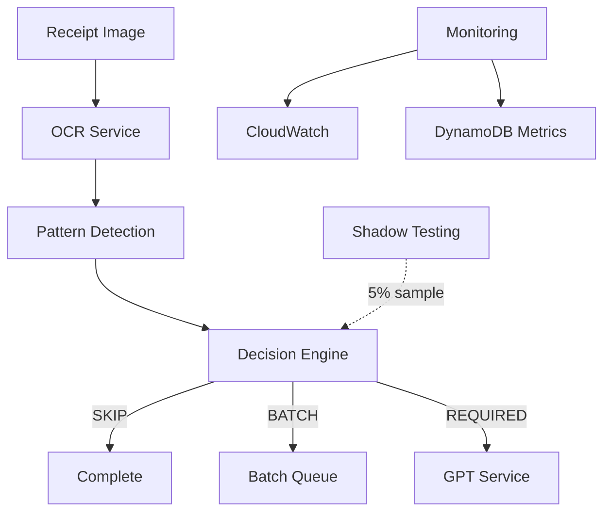

# Receipt Labeling System - Operational Runbook

## Table of Contents

1. [System Overview](#system-overview)
2. [Key Metrics & Monitoring](#key-metrics--monitoring)
3. [Common Operations](#common-operations)
4. [Troubleshooting](#troubleshooting)
5. [Performance Tuning](#performance-tuning)
6. [Incident Response](#incident-response)
7. [Maintenance Procedures](#maintenance-procedures)

---

## System Overview

### Architecture Components



### Key Services

- **Pattern Detection**: Identifies known patterns (dates, totals, etc.)
- **Decision Engine**: Determines if GPT processing is needed
- **Shadow Testing**: Validates SKIP/BATCH decisions
- **Token Ledger**: Tracks API usage and costs
- **PII Masker**: Protects sensitive data before external APIs

---

## Key Metrics & Monitoring

### Critical Metrics

| Metric | Target | Alert Threshold | Location |
|--------|--------|-----------------|----------|
| **False Skip Rate** | < 0.5% | > 1% | CloudWatch Custom Metric |
| **GPT Latency (p99)** | < 200ms | > 300ms | `gpt_time_ms` metric |
| **Pattern Detection Latency** | < 50ms | > 100ms | `pattern_time_ms` metric |
| **GPT Token Cost/Receipt** | < $0.05 | > $0.10 | Token Ledger |
| **Decision Distribution** | SKIP: 70-85% | SKIP < 60% | Production Monitor |

### Dashboard Queries

#### CloudWatch Insights - Decision Distribution
```sql
fields @timestamp, decision, count
| filter @message like /GPT decision made/
| stats count() by decision
| sort count desc
```

#### DynamoDB - Token Usage by Service
```python
# Query TokenLedger table
response = dynamo.query(
    TableName='receipt-processing',
    IndexName='GSI1',
    KeyConditionExpression='GSI1PK = :pk AND begins_with(GSI1SK, :sk)',
    ExpressionAttributeValues={
        ':pk': 'AI_USAGE#gpt-4',
        ':sk': f'DATE#{today}'
    }
)
```

### Real-time Monitoring

```bash
# Watch decision engine metrics
watch -n 5 'aws cloudwatch get-metric-statistics \
  --namespace ReceiptLabeling \
  --metric-name DecisionRate \
  --dimensions Name=Decision,Value=SKIP \
  --start-time 2024-01-01T00:00:00Z \
  --end-time 2024-01-01T23:59:59Z \
  --period 300 \
  --statistics Average'

# Monitor shadow testing validation
aws logs tail /aws/lambda/receipt-processor \
  --filter-pattern "[timestamp] *SHADOW_TEST*" \
  --follow
```

---

## Common Operations

### 1. Adjusting Decision Thresholds

```bash
# Lower threshold for more aggressive GPT skipping
export DECISION_ENGINE_UNLABELED_THRESHOLD=3

# Increase confidence requirement
export DECISION_ENGINE_MIN_CONFIDENCE=0.8

# Restart service to apply changes
aws ecs update-service --cluster prod --service receipt-processor --force-new-deployment
```

### 2. Updating Merchant Patterns

```bash
# Edit merchant patterns
vi receipt_label/pattern_detection/merchant_patterns.yaml

# Add new patterns for a merchant category
# restaurant:
#   PRODUCT_NAME:
#     - new item name
#     - another item

# Deploy changes
git add merchant_patterns.yaml
git commit -m "Add new merchant patterns for restaurants"
git push origin main

# Trigger pattern reload (if hot-reload enabled)
aws lambda invoke --function-name reload-merchant-patterns response.json
```

### 3. Enable/Disable Shadow Testing

```python
# Disable shadow testing temporarily
monitored_system = MonitoredLabelingSystem(
    decision_engine=engine,
    pattern_orchestrator=orchestrator,
    enable_shadow_testing=False  # Disable
)

# Or via environment variable
export DECISION_ENGINE_SHADOW_TEST_PCT=0  # 0% = disabled
```

### 4. View Token Usage Report

```python
# Generate daily token usage report
from receipt_label.monitoring.token_ledger import TokenLedger

ledger = TokenLedger(dynamo_client)
report = ledger.get_usage_summary(
    start_date="2024-01-01",
    end_date="2024-01-31"
)

print(f"Total tokens: {report['total_tokens']:,}")
print(f"Total cost: ${report['total_cost_usd']:.2f}")
print(f"Average per receipt: ${report['avg_cost_per_receipt']:.4f}")
```

---

## Troubleshooting

### High False Skip Rate

**Symptoms**: Shadow testing shows > 1% false skips

**Investigation**:
```python
# Check which merchants have high false skips
shadow_report = shadow_test_manager.get_validation_summary()
for merchant in shadow_report['by_merchant']:
    if merchant['false_skip_rate'] > 0.01:
        print(f"High false skips: {merchant['name']} - {merchant['false_skip_rate']:.2%}")
```

**Solutions**:
1. Add merchant-specific essential labels
2. Improve pattern detection for that merchant
3. Lower unlabeled word threshold temporarily

### GPT Latency Spikes

**Symptoms**: p99 latency > 300ms

**Investigation**:
```bash
# Check latency buckets
aws cloudwatch get-metric-statistics \
  --namespace ReceiptLabeling \
  --metric-name gpt_time_ms \
  --start-time 2024-01-01T00:00:00Z \
  --end-time 2024-01-01T01:00:00Z \
  --period 60 \
  --statistics Maximum,Average,Minimum
```

**Solutions**:
1. Check GPT API status page
2. Implement request retry with backoff
3. Route to backup GPT endpoint
4. Increase BATCH threshold temporarily

### Pattern Detection Failures

**Symptoms**: Low pattern detection rate

**Investigation**:
```python
# Analyze pattern detection success rate
from receipt_label.pattern_detection.orchestrator import ParallelPatternOrchestrator

orchestrator = ParallelPatternOrchestrator()
stats = orchestrator.get_statistics()

print(f"Currency patterns: {stats['currency_detection_rate']:.1%}")
print(f"Date patterns: {stats['date_detection_rate']:.1%}")
print(f"Merchant patterns: {stats['merchant_pattern_hits']}")
```

**Solutions**:
1. Update regex patterns for new formats
2. Add merchant-specific patterns
3. Retrain semantic mapper

---

## Performance Tuning

### Optimize for Cost

```python
# Configuration for cost optimization
config = {
    # Aggressive GPT skipping
    "MEANINGFUL_UNLABELED_WORDS_THRESHOLD": 3,
    
    # Higher batch threshold
    "BATCH_THRESHOLD_PERCENTAGE": 0.7,
    
    # Lower shadow testing
    "SHADOW_TEST_PERCENTAGE": 0.01,
    
    # Use cheaper GPT model for batch
    "BATCH_MODEL": "gpt-3.5-turbo"
}
```

### Optimize for Quality

```python
# Configuration for quality optimization
config = {
    # Conservative GPT skipping
    "MEANINGFUL_UNLABELED_WORDS_THRESHOLD": 8,
    
    # Lower batch threshold
    "BATCH_THRESHOLD_PERCENTAGE": 0.3,
    
    # Higher shadow testing
    "SHADOW_TEST_PERCENTAGE": 0.10,
    
    # Use best model
    "GPT_MODEL": "gpt-4-turbo"
}
```

### A/B Test Configuration

```python
# Set up A/B test for threshold changes
monitored_system.setup_ab_test(
    test_name="lower_threshold_test",
    description="Test impact of threshold 3 vs 5",
    control_method=LabelingMethod.AGENT_BASED,  # Threshold 5
    treatment_method=LabelingMethod.AGENT_BASED_V2,  # Threshold 3
    traffic_split_percentage=20.0,
    duration_days=7,
    auto_start=True
)

# Monitor results
results = monitored_system.get_test_results("lower_threshold_test")
print(f"Control false skip rate: {results['control']['false_skip_rate']:.2%}")
print(f"Treatment false skip rate: {results['treatment']['false_skip_rate']:.2%}")
```

---

## Incident Response

### Runbook: High Error Rate

1. **Check CloudWatch Alarms**
   ```bash
   aws cloudwatch describe-alarms --alarm-names "ReceiptProcessingErrors"
   ```

2. **Identify Error Pattern**
   ```bash
   aws logs insights query \
     --log-group-name /aws/lambda/receipt-processor \
     --start-time $(date -u -d '1 hour ago' +%s) \
     --end-time $(date +%s) \
     --query "fields @timestamp, @message | filter @message like /ERROR/"
   ```

3. **Common Fixes**:
   - **PII in logs**: Enable PII masking
   - **GPT timeout**: Increase timeout, add retry
   - **Pattern failure**: Rollback pattern changes
   - **OOM errors**: Increase Lambda memory

### Runbook: Cost Spike

1. **Check Token Usage**
   ```python
   # Identify high-usage receipts
   high_cost_receipts = ledger.get_high_cost_receipts(
       threshold_usd=0.50,
       limit=100
   )
   ```

2. **Analyze Decision Distribution**
   ```python
   # Check if SKIP rate dropped
   stats = monitor.get_statistics()
   skip_rate = stats['decision_distribution']['SKIP'] / stats['total_sessions']
   if skip_rate < 0.60:
       print("WARNING: Low SKIP rate causing cost spike")
   ```

3. **Emergency Measures**:
   - Increase batch threshold to 80%
   - Lower unlabeled word threshold to 3
   - Disable shadow testing temporarily
   - Route non-critical merchants to batch

---

## Maintenance Procedures

### Daily Tasks

- [ ] Review CloudWatch dashboard
- [ ] Check false skip rate from shadow testing
- [ ] Monitor token usage vs budget
- [ ] Review any failed receipts

### Weekly Tasks

- [ ] Analyze merchant pattern performance
- [ ] Review A/B test results
- [ ] Update merchant patterns based on failures
- [ ] Cost optimization review

### Monthly Tasks

- [ ] Full system performance review
- [ ] Update operational thresholds based on metrics
- [ ] Merchant pattern cleanup (remove low-value patterns)
- [ ] Security audit (PII masking effectiveness)

### Deployment Checklist

1. **Pre-deployment**
   - [ ] Run integration tests
   - [ ] Check pattern file syntax
   - [ ] Verify config changes
   - [ ] Review shadow test results

2. **Deployment**
   - [ ] Deploy to staging
   - [ ] Run smoke tests
   - [ ] Monitor error rates
   - [ ] Deploy to production (canary)

3. **Post-deployment**
   - [ ] Monitor metrics for 30 minutes
   - [ ] Check decision distribution
   - [ ] Verify token usage normal
   - [ ] Complete rollout if stable

### Rollback Procedure

```bash
# Quick rollback
aws lambda update-function-code \
  --function-name receipt-processor \
  --s3-bucket deployments \
  --s3-key previous-version.zip

# Rollback ECS service
aws ecs update-service \
  --cluster prod \
  --service receipt-processor \
  --task-definition receipt-processor:previous

# Rollback configuration
aws ssm put-parameter \
  --name /receipt-processor/config \
  --value file://previous-config.json \
  --overwrite
```

---

## Emergency Contacts

- **On-call Engineer**: Check PagerDuty
- **AWS Support**: Premium support case for P1 issues
- **GPT API Support**: OpenAI platform status page
- **Internal Escalation**: #receipt-processing-oncall Slack channel

---

## Useful Commands Reference

```bash
# View real-time logs
aws logs tail /aws/lambda/receipt-processor --follow

# Get current configuration
aws ssm get-parameters-by-path --path /receipt-processor/

# Force pattern reload
aws lambda invoke --function-name reload-patterns out.json

# Emergency kill switch (route all to batch)
aws ssm put-parameter \
  --name /receipt-processor/emergency-batch-mode \
  --value "true" \
  --overwrite

# Generate cost report
python -m receipt_label.scripts.generate_cost_report \
  --start-date 2024-01-01 \
  --end-date 2024-01-31 \
  --output monthly-report.csv
```