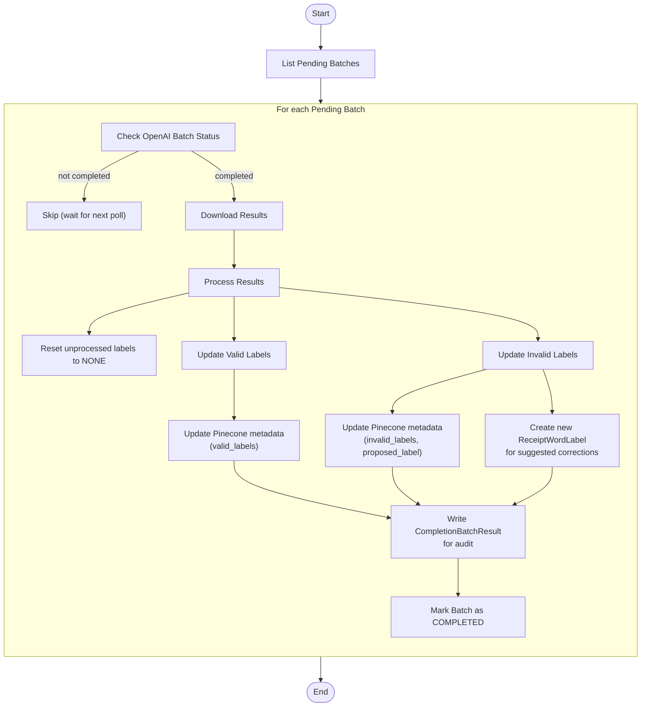

# Poll Completion Batch

This module manages the asynchronous polling of OpenAI completion jobs submitted by the submission pipeline. Given a `batch_id`, it periodically checks the job status via OpenAI’s API until the job reaches a terminal state. Upon successful completion, it downloads the NDJSON result file, parses each entry into a `CompletionBatchResult`, and emits these results to the downstream processing Step Function for validation handling. This module does not modify any `ReceiptWordLabel` records directly—it only retrieves and models the raw completion outputs.

---

## 📦 Functions

### `list_pending_completion_batches() -> list[BatchSummary]`

Fetches all `BatchSummary` items with `status = "PENDING"` and `batch_type = "COMPLETION"`.

### `get_openai_batch_status(openai_batch_id: str) -> str`

Retrieves the current status of an OpenAI batch job (e.g., "validating", "in_progress", "completed", "failed").

### `download_openai_batch_result(batch_summary: BatchSummary) -> tuple[list[ReceiptWordLabel], list[LabelResult], list[LabelResult]]`

Downloads and parses the batch completion results from OpenAI. Returns:
- `pending_labels_to_update`: Labels that should be reset to `NONE` status
- `valid_labels`: List of `LabelResult` objects where `is_valid = True`
- `invalid_labels`: List of `LabelResult` objects where `is_valid = False`

### `update_pending_labels(pending_labels_to_update: list[ReceiptWordLabel]) -> None`

Updates labels that weren't processed in the batch back to `validation_status = NONE`.

### `update_valid_labels(valid_labels_results: list[LabelResult]) -> None`

Updates validated labels in DynamoDB (sets `validation_status = VALID`) and merges the valid labels into Pinecone metadata.

### `update_invalid_labels(invalid_labels_results: list[LabelResult]) -> None`

Handles invalid labels by:
- Setting `validation_status = INVALID` or `NEEDS_REVIEW`
- Creating new `ReceiptWordLabel` entries for suggested corrections
- Updating Pinecone metadata with invalid labels and proposed corrections

### `write_completion_batch_results(batch_summary: BatchSummary, valid_results: list[LabelResult], invalid_results: list[LabelResult]) -> None`

Persists the OpenAI batch outcomes to the `CompletionBatchResult` table for audit and tracking.

### `update_batch_summary(batch_summary: BatchSummary) -> None`

Marks the batch as `COMPLETED` in DynamoDB.

---

## 🧠 Usage

1. **PollList** state

   1. Retrieve all pending completion batches using  
      `list_pending_completion_batches()`.
   2. Filter for batches with `status = PENDING` and `batch_type = COMPLETION`.  
      _Output:_ an array of `BatchSummary` objects to process.

2. **PollDownload** state _(Map – runs once per pending batch)_

   1. Check the OpenAI batch status →  
      `get_openai_batch_status()`.
   2. If status is `"completed"`:
      - Download and parse results →  
        `download_openai_batch_result()`.
      - Update pending labels back to `NONE` →  
        `update_pending_labels()`.
      - Process valid labels →  
        `update_valid_labels()`.
      - Handle invalid labels and create corrections →  
        `update_invalid_labels()`.
      - Write results for audit →  
        `write_completion_batch_results()`.
      - Mark batch as completed →  
        `update_batch_summary()`.
   3. If status is `"failed"`:
      - Handle error and update batch status accordingly.
   4. If status is still pending:
      - Exit and retry in the next polling cycle.

3. **Integration with Step Functions**
   
   The polling pipeline typically runs on a schedule (e.g., every 5-10 minutes) to:
   - Check all pending batches
   - Process completed batches in parallel
   - Update DynamoDB and Pinecone with validation results
   - Create new labels for OpenAI's suggested corrections

> **Note:** The polling system includes timeout protection (default 300s) to prevent 
> infinite waiting when OpenAI batches are stuck in "validating" status.

---

## 📊 Step Function Architecture

