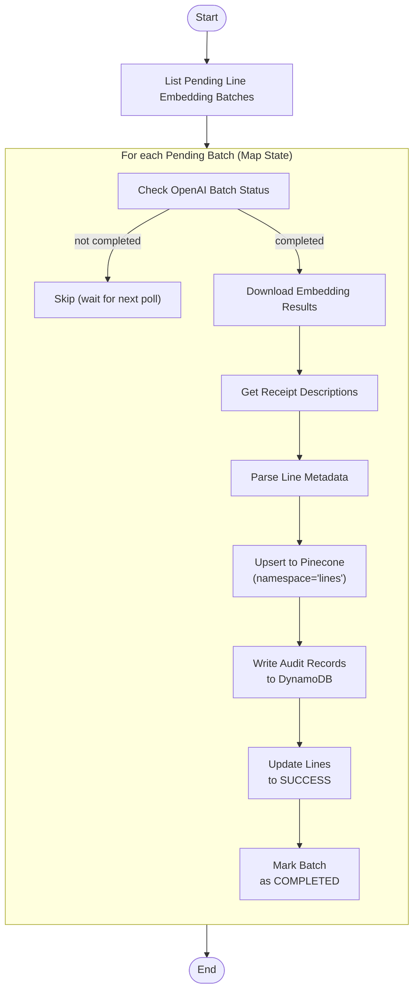

# Poll Line Embedding Batch

This module handles the polling, result retrieval, and ingestion pipeline for line embedding batch jobs submitted to OpenAI's Batch API. It monitors batch status, downloads completed embeddings, and stores them in Pinecone for vector search capabilities.

---

## 📦 Functions

### `list_pending_line_embedding_batches() -> list[BatchSummary]`

Fetches all line embedding batches with `status = "PENDING"` and `batch_type = "LINE_EMBEDDING"`.

### `get_openai_batch_status(openai_batch_id: str) -> str`

Retrieves the current status of an OpenAI batch job (e.g., "validating", "in_progress", "completed", "failed").

### `download_openai_batch_result(openai_batch_id: str) -> list[dict]`

Downloads and parses the NDJSON results from a completed OpenAI batch, returning a list of:
- `custom_id`: The line identifier
- `embedding`: The vector embedding (list of floats)

### `get_receipt_descriptions(results: list[dict]) -> dict[str, dict[int, dict]]`

Fetches comprehensive receipt data for all lines in the batch results, including:
- Receipt details
- All lines, words, and letters
- Tags and labels
- Metadata and sections

### `upsert_line_embeddings_to_pinecone(results: list[dict], descriptions: dict) -> int`

Inserts line embeddings into Pinecone with rich metadata:
- **Spatial data**: x, y coordinates, width, height
- **Text content**: Line text and confidence scores
- **Context**: Previous and next line text
- **Merchant info**: Canonical or original merchant name
- **Section**: Section type if labeled, otherwise "UNLABELED"

Uses namespace "lines" and processes in batches of 100.

### `write_line_embedding_results_to_dynamo(results: list[dict], descriptions: dict, batch_id: str) -> int`

Creates `EmbeddingBatchResult` records for audit tracking with:
- `word_id = 0` (not applicable for lines)
- Line text and pinecone_id
- Status = "SUCCESS"

Writes in chunks of 25 items.

### `update_line_embedding_status_to_success(results: list[dict], descriptions: dict) -> None`

Updates all successfully embedded lines to `embedding_status = "SUCCESS"` in DynamoDB.

### `mark_batch_complete(batch_id: str) -> None`

Updates the `BatchSummary` to `status = "COMPLETED"` to prevent reprocessing.

---

## 🧠 Usage

1. **PollList** state

   1. Retrieve all pending line embedding batches →  
      `list_pending_line_embedding_batches()`.  
      _Output:_ array of batches with `openai_batch_id` and `batch_id`.

2. **PollDownload** state _(Map – runs once per pending batch)_

   1. Check the OpenAI batch status →  
      `get_openai_batch_status()`.
   2. If status is `"completed"`:
      - Download embedding results →  
        `download_openai_batch_result()`.
      - Fetch full receipt context →  
        `get_receipt_descriptions()`.
      - Upsert vectors to Pinecone →  
        `upsert_line_embeddings_to_pinecone()`.
      - Write audit records →  
        `write_line_embedding_results_to_dynamo()`.
      - Update line status →  
        `update_line_embedding_status_to_success()`.
      - Mark batch complete →  
        `mark_batch_complete()`.
   3. If status is not completed:
      - Skip processing and wait for next poll cycle.

> **Important:** Line embeddings are stored in Pinecone's "lines" namespace,  
> separate from word embeddings which use the "words" namespace.

---

## 📊 Step Function Architecture

