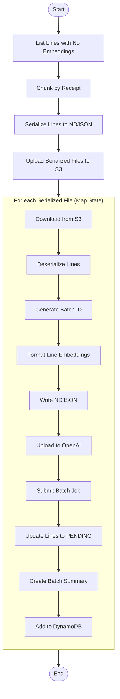

# Submit Line Embedding Batch

This module handles the preparation and submission of line embedding batches to OpenAI's asynchronous Batch API. It processes entire lines of text from receipts to generate embeddings for section classification and contextual understanding.

---

## 📦 Functions

### `list_receipt_lines_with_no_embeddings() -> list[ReceiptLine]`

Fetches all `ReceiptLine` items with `embedding_status = "NONE"`.

### `chunk_into_line_embedding_batches(lines: list[ReceiptLine]) -> dict[str, dict[int, list[ReceiptLine]]]`

Splits the list of lines into chunks based on `(image_id, receipt_id)` combinations.

### `serialize_receipt_lines(line_receipt_dict: dict[str, dict[int, list[ReceiptLine]]]) -> list[dict]`

Serializes lines into NDJSON files, one per receipt, and returns metadata about each file.

### `upload_serialized_lines(serialized_lines: list[dict], s3_bucket: str, prefix="line_embeddings") -> list[dict]`

Uploads the serialized NDJSON files to S3 and adds the S3 key to each file's metadata.

### `download_serialized_lines(s3_bucket: str, s3_key: str) -> Path`

Downloads a serialized lines file from S3 to local storage.

### `deserialize_receipt_lines(filepath: Path) -> list[ReceiptLine]`

Deserializes an NDJSON file back into `ReceiptLine` objects.

### `generate_batch_id() -> str`

Generates a unique UUID for the embedding batch.

### `format_line_context_embedding(lines_to_embed: list[ReceiptLine]) -> list[dict]`

Formats each line into an OpenAI-compatible embedding request using the text-embedding-3-small model.

### `write_ndjson(batch_id: str, input_data: list[dict]) -> Path`

Writes the formatted embedding requests to an NDJSON file.

### `upload_to_openai(filepath: Path) -> FileObject`

Uploads the NDJSON file to OpenAI's file endpoint for batch processing.

### `submit_openai_batch(file_id: str) -> Batch`

Submits the embedding batch job to OpenAI with a 24-hour completion window.

### `create_batch_summary(batch_id: str, open_ai_batch_id: str, file_path: str) -> BatchSummary`

Creates a `BatchSummary` entity with:
- `status = "PENDING"`
- `batch_type = "LINE_EMBEDDING"`
- Receipt references extracted from the NDJSON file

### `add_batch_summary(summary: BatchSummary) -> None`

Persists the batch summary to DynamoDB.

### `update_line_embedding_status(lines: list[ReceiptLine]) -> None`

Updates all processed lines to `embedding_status = "PENDING"` in DynamoDB.

---

## 🧠 Usage

1. **SubmitList** state

   1. Retrieve all lines needing embeddings →  
      `list_receipt_lines_with_no_embeddings()`.
   2. Group them by receipt →  
      `chunk_into_line_embedding_batches()`.
   3. Serialize each group to NDJSON →  
      `serialize_receipt_lines()`.
   4. Upload all files to S3 →  
      `upload_serialized_lines()`.  
      _Output:_ array of file metadata containing `image_id`, `receipt_id`, and `s3_key`.

2. **SubmitUpload** state _(Map – runs once per serialized file)_

   1. Download the serialized file from S3 →  
      `download_serialized_lines()`.
   2. Deserialize back to `ReceiptLine` objects →  
      `deserialize_receipt_lines()`.
   3. Generate a unique batch ID →  
      `generate_batch_id()`.
   4. Format lines for OpenAI embeddings →  
      `format_line_context_embedding()`.
   5. Write formatted requests to NDJSON →  
      `write_ndjson()`.
   6. Upload to OpenAI Files API →  
      `upload_to_openai()`.
   7. Submit the batch job →  
      `submit_openai_batch()`.
   8. Update line status in DynamoDB →  
      `update_line_embedding_status()`.
   9. Create and store batch summary →  
      `create_batch_summary()` → `add_batch_summary()`.

> **Note:** Each line's custom_id follows the format:  
> `IMAGE#{image_id}#RECEIPT#{receipt_id:05d}#LINE#{line_id:05d}`

---

## 📊 Step Function Architecture

