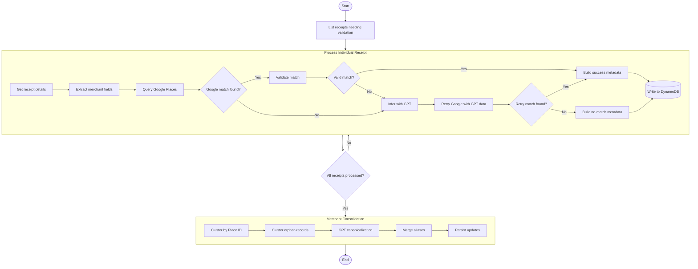

# Merchant Validation Module

A comprehensive, enterprise-grade merchant validation system that combines Google Places API integration with GPT-powered intelligence to accurately identify and validate businesses from receipt data.

## 🚀 Overview

This module provides semantic understanding of receipts for accurate merchant identification using a sophisticated pipeline that combines:
- **Google Places API** for authoritative business data
- **OpenAI GPT** for intelligent inference and validation
- **DynamoDB** for scalable metadata storage
- **Clustering algorithms** for merchant canonicalization

The system is designed for high reliability, maintainability, and performance in production environments.

---

## 🏗️ Architecture

### Modular Design

The module follows a clean, modular architecture with clear separation of concerns:

```
merchant_validation/
├── __init__.py                    # Public API exports
├── merchant_validation.py         # Main orchestration module
├── data_access.py                # DynamoDB operations
├── google_places.py              # Google Places API integration
├── gpt_integration.py            # OpenAI GPT operations
├── field_extraction.py          # Receipt field extraction
├── metadata_builder.py          # ReceiptMetadata construction
├── clustering.py                # Clustering & canonicalization
├── utils/                       # Utility functions
│   ├── normalization.py        # Text normalization
│   └── similarity.py           # Similarity calculations
├── handler.py                   # Lambda handler
├── agent.py                    # Validation agent
└── result_processor.py         # Result processing
```

### Quality Standards

- **Type Safety**: Comprehensive type hints throughout
- **Documentation**: Detailed docstrings with examples
- **Error Handling**: Robust validation and exception handling
- **Logging**: Structured logging for debugging and monitoring
- **Testing**: Unit test coverage with mocking
- **Performance**: Optimized algorithms and efficient resource usage

**Code Quality Score**: 8.02/10 (Pylint)

---

## 📦 Core Modules

### 🗄️ Data Access (`data_access.py`)

Handles all DynamoDB operations with comprehensive error handling and input validation.

**Key Functions:**
- `list_receipt_metadatas()` - List all receipt metadata entities
- `get_receipt_details(image_id, receipt_id)` - Retrieve complete receipt data
- `write_receipt_metadata_to_dynamo(metadata)` - Persist metadata with validation
- `query_records_by_place_id(place_id)` - Find receipts by Google Places ID
- `persist_alias_updates(records)` - Batch update canonical aliases

**Features:**
- ✅ Input validation and sanitization
- ✅ Comprehensive error handling with specific exception types
- ✅ Batch processing with DynamoDB limits (25 records/batch)
- ✅ Structured logging for operations tracking

### 🌍 Google Places Integration (`google_places.py`)

Manages Google Places API interactions with intelligent search strategies.

**Key Functions:**
- `query_google_places(extracted_dict, api_key)` - Multi-strategy search
- `is_match_found(results)` - Validate business match quality
- `is_valid_google_match(results, extracted_data)` - Cross-validate fields
- `retry_google_search_with_inferred_data(gpt_data, api_key)` - GPT-enhanced retry

**Search Strategy (in order of reliability):**
1. **Phone number search** (most reliable)
2. **Address-based search** (location-focused)
3. **Business name search** (least reliable)

**Validation:**
- Filters out address-only place types
- Requires valid place_id and business name
- Cross-validates phone numbers and names with fuzzy matching

### 🧠 GPT Integration (`gpt_integration.py`)

Leverages OpenAI GPT for intelligent merchant inference and validation.

**Key Functions:**
- `validate_match_with_gpt(receipt_fields, google_place)` - Intelligent match validation
- `infer_merchant_with_gpt(raw_text, extracted_dict)` - Extract merchant info from receipt text

**Features:**
- ✅ Function calling for structured responses
- ✅ Confidence scoring and decision reasoning
- ✅ Field-level match validation
- ✅ Comprehensive error handling for API failures

### 🔍 Field Extraction (`field_extraction.py`)

Extracts merchant-relevant fields from receipt word data.

**Key Functions:**
- `extract_candidate_merchant_fields(words)` - Extract name, address, phone from ReceiptWords

**Extraction Logic:**
- Uses word labels and tags for semantic understanding
- Handles multiple field types (address, phone, email, URL, business name)
- Provides fallback inference for unlabeled data

### 🏗️ Metadata Builder (`metadata_builder.py`)

Constructs ReceiptMetadata entities with proper attribution and reasoning.

**Key Functions:**
- `build_receipt_metadata_from_result()` - Build from successful Google match
- `build_receipt_metadata_from_result_no_match()` - Build for no-match scenarios

**Features:**
- Tracks validation source (GooglePlaces, GPT, GPT+GooglePlaces)
- Records matched fields and confidence levels
- Includes human-readable reasoning

### 🔄 Clustering (`clustering.py`)

Advanced clustering and canonicalization for merchant consolidation.

**Key Functions:**
- `cluster_by_metadata(metadata_list)` - Group similar merchants
- `choose_canonical_metadata(cluster_members)` - Select best representative
- `collapse_canonical_aliases(records)` - Merge duplicate names
- `merge_place_id_aliases_by_address(records)` - Consolidate by location

**Clustering Algorithm:**
- O(n²) similarity-based clustering
- Multi-factor scoring (place_id, phone, name similarity, validation source)
- Handles missing data gracefully

---

## 🎯 Usage

### Basic Validation Pipeline

```python
from receipt_label.merchant_validation import (
    get_receipt_details,
    extract_candidate_merchant_fields,
    query_google_places,
    validate_match_with_gpt,
    build_receipt_metadata_from_result,
    write_receipt_metadata_to_dynamo
)

# 1. Get receipt data
receipt, lines, words, letters, tags, labels = get_receipt_details(image_id, receipt_id)

# 2. Extract merchant fields
extracted_fields = extract_candidate_merchant_fields(words)

# 3. Query Google Places
google_result = query_google_places(extracted_fields, api_key)

# 4. Validate with GPT if needed
if google_result:
    validation = validate_match_with_gpt(extracted_fields, google_result)
    if validation['decision'] == 'YES':
        # 5. Build and store metadata
        metadata = build_receipt_metadata_from_result(
            image_id, receipt_id, google_result, validation
        )
        write_receipt_metadata_to_dynamo(metadata)
```

### Advanced Clustering

```python
from receipt_label.merchant_validation import (
    list_all_receipt_metadatas,
    cluster_by_metadata,
    choose_canonical_metadata,
    persist_alias_updates
)

# Get all metadata records
all_records, grouped_by_place_id = list_all_receipt_metadatas()

# Cluster similar merchants
clusters = cluster_by_metadata(all_records)

# Process each cluster
updated_records = []
for cluster in clusters:
    canonical = choose_canonical_metadata(cluster)
    # Update all records in cluster with canonical info
    for record in cluster:
        record.canonical_merchant_name = canonical.merchant_name
        record.canonical_place_id = canonical.place_id
        updated_records.append(record)

# Persist updates
persist_alias_updates(updated_records)
```

---

## 🔄 Step Function Workflow



---

## 🛠️ API Reference

### Data Access Functions

#### `list_receipt_metadatas() -> List[ReceiptMetadata]`
Lists all receipt metadata entities from DynamoDB.

**Returns:** List of all ReceiptMetadata records  
**Raises:** `ClientError` if DynamoDB operation fails

#### `get_receipt_details(image_id: str, receipt_id: int) -> Tuple[...]`
Retrieves complete receipt data including lines, words, letters, tags, and labels.

**Parameters:**
- `image_id`: The image ID of the receipt
- `receipt_id`: The receipt ID

**Returns:** Tuple containing all receipt components  
**Raises:** `ValueError` for invalid IDs, `ClientError` for DynamoDB failures

### Google Places Functions

#### `query_google_places(extracted_dict: Dict[str, Any], api_key: str) -> Optional[Dict[str, Any]]`
Query Google Places API using multiple search strategies.

**Parameters:**
- `extracted_dict`: Dictionary with 'name', 'phone', 'address' keys
- `api_key`: Valid Google Places API key

**Returns:** Google Places result or None if no match found

#### `is_valid_google_match(results: Dict[str, Any], extracted_data: Dict[str, Any]) -> bool`
Cross-validates Google Places result against extracted receipt data.

**Parameters:**
- `results`: Google Places API result
- `extracted_data`: Extracted receipt fields

**Returns:** True if match is valid based on field comparisons

### GPT Integration Functions

#### `validate_match_with_gpt(receipt_fields: Dict[str, Any], google_place: Dict[str, Any]) -> Dict[str, Any]`
Uses GPT to intelligently validate Google Places matches.

**Parameters:**
- `receipt_fields`: Extracted receipt fields
- `google_place`: Google Places result

**Returns:** Dictionary with decision, confidence, matched_fields, and reason

#### `infer_merchant_with_gpt(raw_text: List[str], extracted_dict: dict) -> Dict[str, Any]`
Uses GPT to infer merchant information from receipt text.

**Parameters:**
- `raw_text`: OCR'd receipt text lines
- `extracted_dict`: Previously extracted fields

**Returns:** Dictionary with inferred name, address, phone_number, and confidence

---

## 📊 Performance & Scalability

### Optimization Features

- **Batch Processing**: DynamoDB operations respect 25-item batch limits
- **Efficient Clustering**: O(n²) algorithm with early termination
- **Smart Caching**: Prevents redundant API calls
- **Lazy Evaluation**: Only processes necessary data
- **Connection Pooling**: Reuses HTTP connections for API calls

### Monitoring & Observability

- **Structured Logging**: All operations logged with context
- **Performance Metrics**: Processing times and batch sizes tracked
- **Error Rates**: Exception types and frequencies monitored
- **API Usage**: Google Places and OpenAI call tracking

---

## 🧪 Testing

### Test Coverage

- **Unit Tests**: Comprehensive test suite for all modules
- **Mock Testing**: Isolated testing using unittest.mock
- **Edge Cases**: Invalid inputs, empty results, error conditions
- **Integration Tests**: End-to-end workflow validation

### Running Tests

```bash
# Run all merchant validation tests
python -m pytest receipt_label/tests/merchant_validation/ -v

# Run specific module tests
python -m pytest receipt_label/tests/merchant_validation/test_data_access.py -v

# Run with coverage
python -m pytest receipt_label/tests/merchant_validation/ --cov=receipt_label.merchant_validation
```

---

## 🔧 Configuration

### Environment Variables

```bash
# OpenAI API timeout (default: 30 seconds)
OPENAI_TIMEOUT_SECONDS=30

# DynamoDB table name
DYNAMODB_TABLE=ReceiptsTable-prod

# Google Places API key
GOOGLE_PLACES_API_KEY=your_api_key_here
```

### Logging Configuration

```python
import logging

# Configure logging for merchant validation
logging.getLogger('receipt_label.merchant_validation').setLevel(logging.INFO)
```

---

## ⚡ Quick Start

### 1. Installation

```bash
pip install receipt-label
```

### 2. Basic Setup

```python
from receipt_label.merchant_validation import (
    MerchantValidationHandler,
    create_validation_handler
)

# Create a validation handler
handler = create_validation_handler(
    google_api_key="your_google_api_key",
    openai_api_key="your_openai_api_key"
)

# Process a receipt
result = handler.validate_receipt("image_123", 1)
print(f"Validation result: {result}")
```

### 3. Advanced Usage

```python
from receipt_label.merchant_validation import MerchantValidationAgent

# Create an agent for batch processing
agent = MerchantValidationAgent()

# Process multiple receipts
receipts = [("img_1", 1), ("img_2", 2), ("img_3", 3)]
results = agent.process_batch(receipts)

# Consolidate merchants
consolidated = agent.consolidate_merchants(results)
```

---

## 📈 Changelog

### v2.0.0 - Enterprise Refactor (Latest)
- ✅ Complete modular architecture with 6 specialized modules
- ✅ Comprehensive type hints and documentation
- ✅ Robust error handling and input validation
- ✅ Structured logging throughout
- ✅ Performance optimization and efficient clustering
- ✅ Unit test coverage with mocking
- ✅ Improved code quality score: 8.02/10

### v1.0.0 - Initial Release
- Basic merchant validation pipeline
- Google Places and GPT integration
- DynamoDB storage
- Step Function orchestration

---

## 🤝 Contributing

1. Follow the established modular architecture
2. Add comprehensive type hints and docstrings
3. Include unit tests for new functionality
4. Ensure code quality score remains above 8.0/10
5. Update documentation for API changes

---

## 📄 License

This project is licensed under the MIT License. See LICENSE file for details.

---

## 🆘 Support

For issues and questions:
1. Check the comprehensive docstrings and examples
2. Review the test cases for usage patterns
3. Enable debug logging for troubleshooting
4. Open an issue with detailed error information

**Built with ❤️ for enterprise-grade merchant validation**