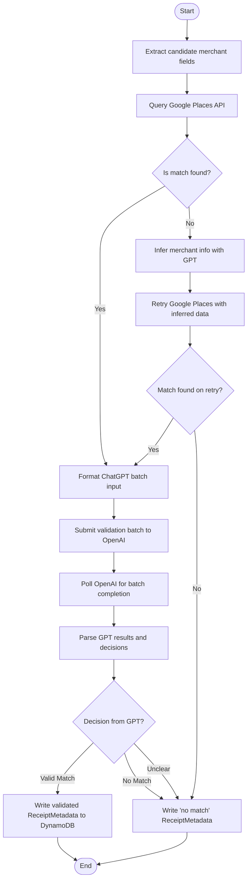

# Merchant Validation

Semantic understanding of receipts is necessary for accurate word labeling. Here, we define some functions to help better develop some metadata for each receipt using a combination of ChatGPT and Google Places.

---

## 📦 Functions

### `extract_candidate_merchant_fields(receipt_words)`

Extracts possible `BUSINESS_NAME`, `ADDRESS_LINE`, and `PHONE` values from `ReceiptWordLabel` or `ReceiptWord` entities. Used as input for Google Places and GPT.

### `search_google_places(business_name, address, phone=None)`

Queries the Google Places API using available fields and returns the top place match, if any.

### `infer_merchant_with_gpt(lines)`

Given a list of top lines from a receipt, ask GPT to return a structured guess for `merchant_name`, `address`, and `phone`. Used when Google fails.

### `validate_match_with_gpt(receipt_fields, google_match)`

Compares extracted receipt fields to the Google result and returns GPT's decision (YES/NO/UNSURE), confidence score, and matched fields.

### `write_receipt_metadata_to_dynamo(metadata)`

Stores a `ReceiptMetadata` entity to DynamoDB based on either a successful or failed match.

### `build_receipt_metadata_from_result(receipt_id, image_id, gpt_result, google_result, raw_receipt_fields)`

Formats the final `ReceiptMetadata` object to store in DynamoDB, including source reasoning and match details.

---

## 📊 Step Function Architecture

