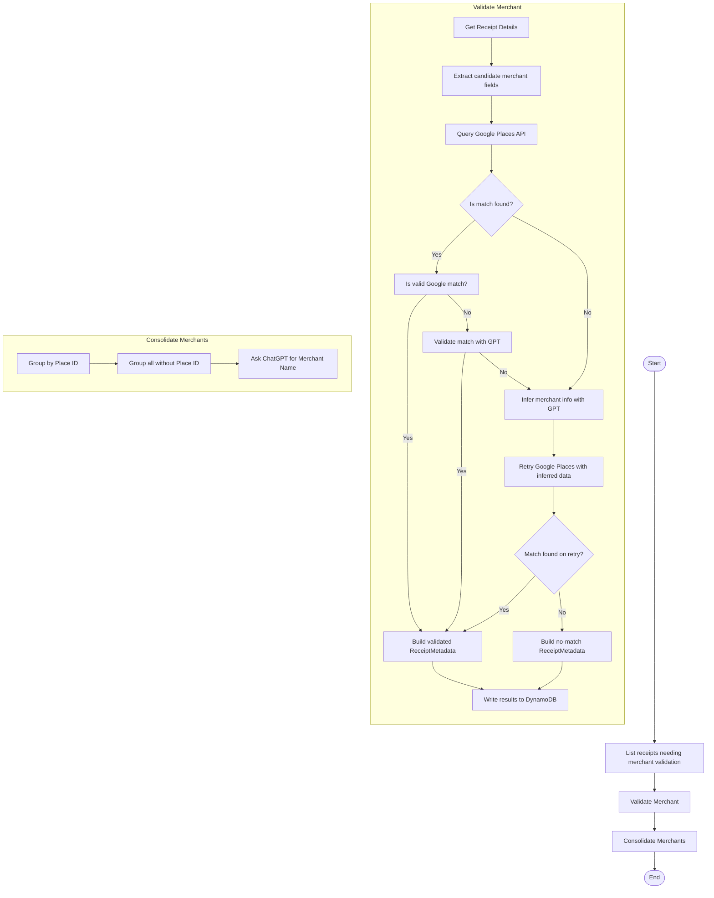

# Merchant Validation

Semantic understanding of receipts is necessary for accurate word labeling. Here, we define some functions to help better develop some metadata for each receipt using a combination of ChatGPT and Google Places.

---

## 📦 Functions

### `list_receipts_for_merchant_validation()`

Lists all receipts that do not have receipt metadata. This provides the `image_id` and `receipt_id` per validation process.

## `get_receipt_details()`

Gets the receipt details given the `image_id` and `receipt_id`. This provides the receipt, lines, words, letters, tags, and labels for the validation.

### `extract_candidate_merchant_fields(words)`

Extracts possible `address`, `url`, and `phone` values from `ReceiptWord` entities.

### `query_google_places(extracted_dict, google_places_api_key)`

Queries the Google Places API using a dict of `ReceiptWords` grouped by type and returns the top place match, if any.

### `is_match_found(results)`

Checks whether the Google Places API query returned any match data.

**Signature:**

```python
def is_match_found(results: Optional[dict]) -> bool:
    """
    Args:
        results (dict or None): The output from `query_google_places`.
    Returns:
        bool: True if a place dict was returned (even if later deemed invalid), False if `None`.
    """
```

Returns `True` when `results` is not `None`, indicating that a Google response was received (regardless of validity).
Returns `False` when `results` is `None`, indicating no match was found.

### `infer_merchant_with_gpt(receipt_word_lines)`

When no result is found in Google Places, this function sends the text of the receipt lines to GPT using function-calling with OpenAI and asks it to infer likely merchant metadata. Returns a structured result containing a guessed merchant name, address, and phone number.

### `write_receipt_metadata_to_dynamo(metadata)`

Stores a `ReceiptMetadata` entity to DynamoDB based on either a successful or failed match.

### `build_receipt_metadata_from_result(receipt_id, image_id, gpt_result, google_result, raw_receipt_fields)`

Builds a `ReceiptMetadata` object from a successful merchant match.

### `retry_google_search_with_inferred_data(gpt_merchant_data)`

Uses the data inferred by GPT (e.g., merchant name + address) to retry a Google Places API search. Returns a new Google match or `None`.

### `build_receipt_metadata_from_result_no_match(receipt_id, image_id, raw_fields, reasoning)`

Builds a `ReceiptMetadata` object for the no‑match scenario.

### `validate_match_with_gpt(receipt_fields, google_place)`

Compares extracted merchant fields against a Google Places result using GPT function-calling. Returns a structured decision including match validity, matched fields, and confidence.

Stores a fallback `ReceiptMetadata` record when no match is found — even after retrying with GPT. Includes the attempted inputs, GPT inferences (if any), and a status of `"NO_MATCH"`.

---

## 🧠 Usage

This module is designed to be run inside a Step Function dedicated to receipt-level merchant validation. It operates independently from the embedding flow and focuses on identifying and validating the business that issued the receipt.

### Step-by-step Usage:

1. **Extract merchant fields** using `extract_candidate_merchant_fields(...)`, pulling from ReceiptWord or ReceiptWordLabel entries.
2. **Query Google Places API** using the extracted fields via `query_google_places(...)`.
3. If Google returns a result:
   - Check if the result is valid using `is_valid_google_match(...)`
   - If invalid, call `validate_match_with_gpt(...)` to determine if GPT accepts the match
   - If either is valid, proceed with `build_receipt_metadata_from_result(...)` and `write_receipt_metadata_to_dynamo(...)`
4. If no Google match is found:
   - **Infer merchant metadata with GPT** via `infer_merchant_with_gpt(...)`
   - **Retry Google Places query** with `retry_google_search_with_inferred_data(...)`
   - If still no match, call `write_no_match_receipt_metadata(...)`
5. **The output of this module is a ReceiptMetadata entity**, saved in DynamoDB, which supports future word label validation and Pinecone scoping.
6. **Consolidate merchant metadata for this run**:
   1. Receive the list of validated receipts (with `place_id`, `merchant_name`, `match_confidence`, etc.).
   2. **Google clusters**: Group receipts by non-empty `place_id`, default the canonical name to Google’s official label.
   3. **Orphan clusters**: Collect receipts without a `place_id` and fuzzy-cluster them by `merchant_name`.
   4. **GPT canonicalization**: For each orphan cluster with multiple variants, call ChatGPT to choose an initial canonical name (or return null).
   5. **Alignment phase**:
      - Normalize the GPT-chosen canonical name and match against existing Google cluster names (ignoring case/punctuation); merge into that Google cluster if matched.
      - Otherwise, perform a Google Places lookup using the GPT canonical name; if valid, merge into that `place_id` cluster with Google’s official label.
      - For names still unmatched, assign `canonical_merchant_name` = GPT name and tag `manual_review = true`.
   6. **Persist results**: Batch-update each `ReceiptMetadata` in DynamoDB to set `canonical_merchant_name`, update `place_id` if newly assigned, and add `manual_review` flag.

## 📊 Step Function Architecture



## 🛠️ Remaining Work

- [ ] Create confidence thresholds or fallback logic when GPT match is “UNSURE”.
- [x] Implement `retry_google_search_with_inferred_data(gpt_merchant_data)`
- [ ] Add tests for `is_valid_google_match(...)` with diverse `place` input cases.
- [x] Implement `build_receipt_metadata_from_result_no_match(...)` to store fallback metadata when no Google match is accepted, even after GPT validation.
- [x] Add retry validation step using `validate_match_with_gpt` on the Google match retrieved via retry.
- [x] Pass the validated GPT result (with boosted confidence and matched_fields) into `build_receipt_metadata_from_result` instead of raw GPT inference.
- [x] Guard against empty phone/address values in `retry_google_search_with_inferred_data` and the caching layer to prevent errors.
- [x] Fix the `search_by_address` cache key generation to stringify receipt words and avoid `TypeError` when elements are not strings.
- [ ] Add unit tests covering:
  - Empty phone/address handling in retry logic.
  - Cache behavior for empty search values.
  - Correct propagation of validated confidence and matched_fields into metadata.
