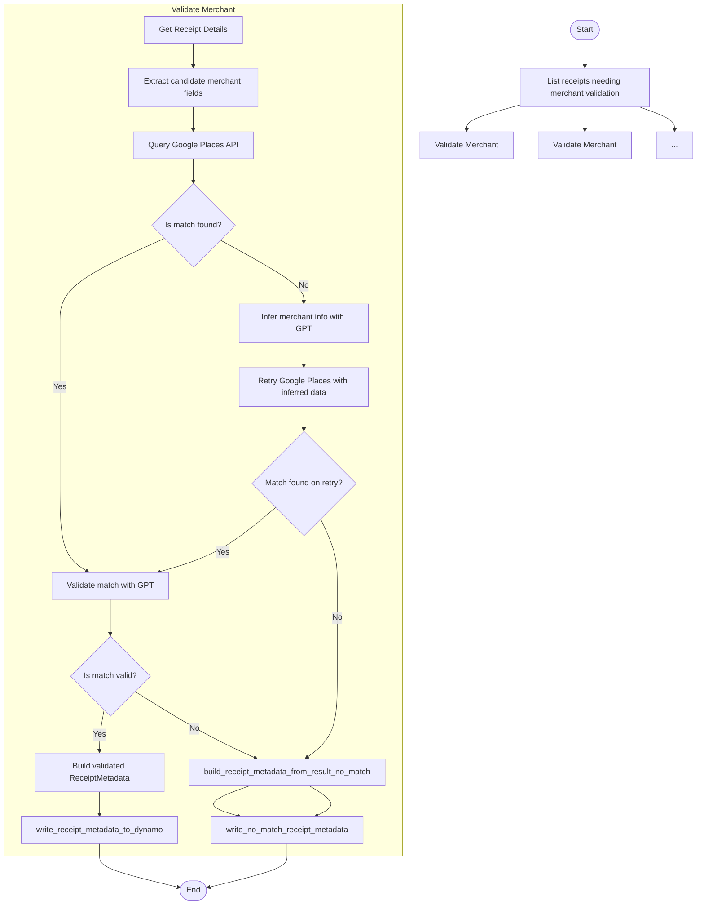

# Merchant Validation

Semantic understanding of receipts is necessary for accurate word labeling. Here, we define some functions to help better develop some metadata for each receipt using a combination of ChatGPT and Google Places.

---

## 📦 Functions

### `list_receipts()`

Lists all receipts. This provides the `image_id` and `receipt_id` per validation process.

## `get_receipt_details()`

Gets the receipt details given the `image_id` and `receipt_id`. This provides the receipt words and lines for the validation.

### `extract_candidate_merchant_fields(image_id, receipt_id)`

Extracts possible `address`, `url`, and `phone` values from `ReceiptWord` entities.

### `query_google_places(addresses, urls, phone_numbers)`

Queries the Google Places API using available fields and returns the top place match, if any.

### `infer_merchant_with_gpt(receipt_word_lines)`

When no result is found in Google Places, this function sends the text of the receipt lines to GPT and asks it to infer likely merchant metadata. Returns a structured result containing a guessed merchant name, address, and phone number.

### `validate_match_with_gpt(receipt_fields, google_match)`

Compares the merchant fields extracted from the receipt to a Google Places match using ChatGPT. This function constructs a structured prompt including the receipt's name, address, and phone number, along with the corresponding Google result, and sends it to GPT to evaluate whether the match is valid.

**Inputs:**

- `receipt_fields` (dict): The raw merchant fields extracted from the receipt (e.g., `"name"`, `"address"`, `"phone"`).
- `google_match` (dict): A Google Places result including `name`, `formatted_address`, `formatted_phone_number`, and `place_id`.

**Returns:**

- A dictionary with GPT's structured decision:
  - `decision`: "YES" | "NO" | "UNSURE"
  - `confidence`: Float between 0–1
  - `matched_fields`: List of field names that aligned
  - `reason`: Explanation from GPT

This result is stored in `ReceiptMetadata` and determines whether the merchant match should be trusted or retried.

### `write_receipt_metadata_to_dynamo(metadata)`

Stores a `ReceiptMetadata` entity to DynamoDB based on either a successful or failed match.

### `build_receipt_metadata_from_result(receipt_id, image_id, gpt_result, google_result, raw_receipt_fields)`

Formats the final `ReceiptMetadata` object to store in DynamoDB, including source reasoning and match details.

### `retry_google_search_with_inferred_data(gpt_merchant_data)`

Uses the data inferred by GPT (e.g., merchant name + address) to retry a Google Places API search. Returns a new Google match or `None`.

### `write_no_match_receipt_metadata(receipt_id, image_id, raw_fields, reasoning)`

Stores a fallback `ReceiptMetadata` record when no match is found — even after retrying with GPT. Includes the attempted inputs, GPT inferences (if any), and a status of `"NO_MATCH"`.

---

## 🧠 Usage

This module is designed to be run inside a Step Function dedicated to receipt-level merchant validation. It operates independently from the embedding flow and focuses on identifying and validating the business that issued the receipt.

### Step-by-step Usage:

1. **Extract merchant fields** using `extract_candidate_merchant_fields(...)`, pulling from ReceiptWord or ReceiptWordLabel entries.
2. **Query Google Places API** using the extracted fields via `query_google_places(...)`.
3. If Google returns a result:
   - **Validate it with GPT** using `validate_match_with_gpt(...)`
   - **Build and write validated ReceiptMetadata** using `build_receipt_metadata_from_result(...)` and `write_receipt_metadata_to_dynamo(...)`
4. If no Google match is found:
   - **Infer merchant metadata with GPT** via `infer_merchant_with_gpt(...)`
   - **Retry Google Places query** with `retry_google_search_with_inferred_data(...)`
   - If still no match, call `write_no_match_receipt_metadata(...)`
5. **The output of this module is a ReceiptMetadata entity**, saved in DynamoDB, which supports future word label validation and Pinecone scoping.

## 📊 Step Function Architecture

