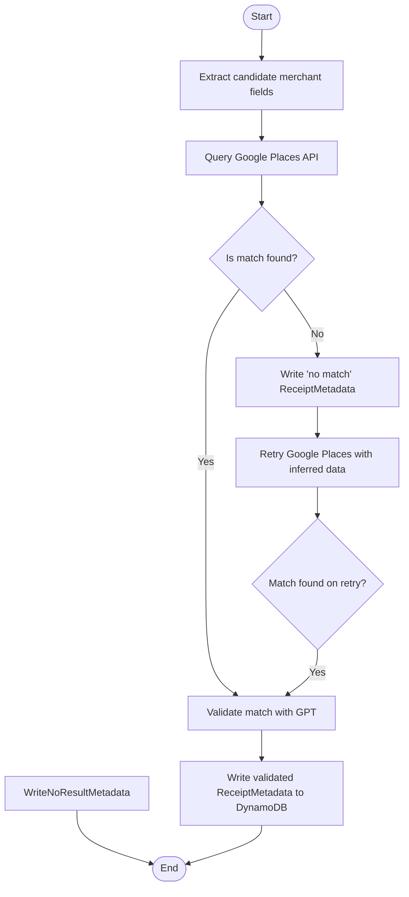

# Merchant Validation

Semantic understanding of receipts is necessary for accurate word labeling. Here, we define some functions to help better develop some metadata for each receipt using a combination of ChatGPT and Google Places.

