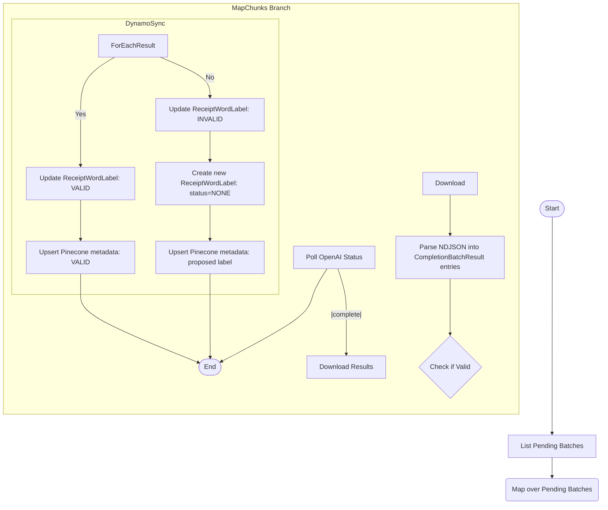

# Poll Completion Batch

This module manages the asynchronous polling of OpenAI completion jobs submitted by the submission pipeline. Given a `batch_id`, it periodically checks the job status via OpenAI’s API until the job reaches a terminal state. Upon successful completion, it downloads the NDJSON result file, parses each entry into a `CompletionBatchResult`, and emits these results to the downstream processing Step Function for validation handling. This module does not modify any `ReceiptWordLabel` records directly—it only retrieves and models the raw completion outputs.

---

## 📦 Functions

---

## 🧠 Usage

---

## 📊 Step Function Architecture

