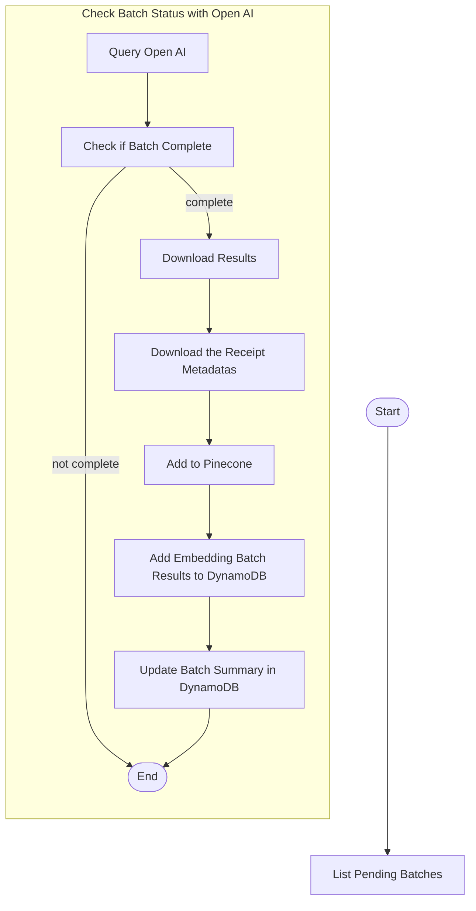

# Poll Embedding Batch

This Step Function periodically polls OpenAI batch embedding jobs and handles successful ingestion into Pinecone. The full flow includes error handling, retries, and updates to the DynamoDB label and batch state.

---

## 🧠 Usage

This module is split across two phases in a Step Function workflow:

### Phase 1: List Pending Batch Embeddings

1. List all Batch Summaries that have a status of "PENDING"

### Phase 2: Poll OpenAI for the Batch Embedding

1. Check if the batch is complete
2. Download completed batch
3. Get Receipt Descriptions for each unique receipt
4. Add to Pinecone Index
5. Add EmbeddingBatchResult to DynamoDB
6. Update BatchSummary in DynamoDB

---

## 📊 Step Function Architecture

