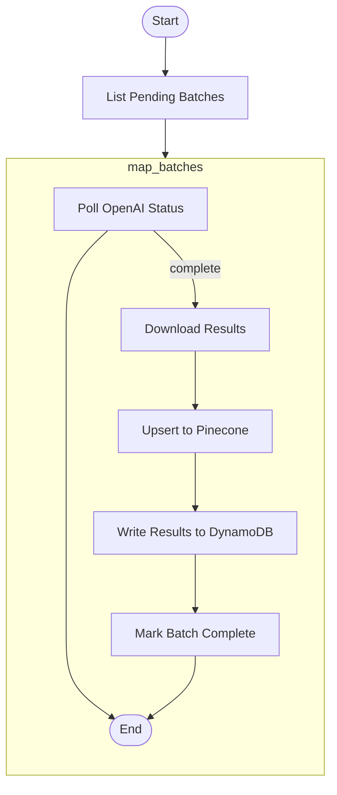

# Poll Embedding Batch

This module handles the polling, result retrieval, and ingestion pipeline for embedding batch jobs submitted to OpenAI's asynchronous Batch API. It is typically used as the second step in a two-phase Step Function workflow, following batch submission.

---

## 📦 Functions

### `list_pending_embedding_batches() -> list[BatchSummary]`

Lists all `BatchSummary` items with `status = "PENDING"` (polls DynamoDB via GSI).

### `download_openai_batch_result(openai_batch_id: str) -> list[dict]`

Downloads the NDJSON results of a completed OpenAI batch job and returns a
list of records each containing:

- `custom_id` (str)
- `embedding` (List[float])

### `upsert_embeddings_to_pinecone(results: list[dict], descriptions: dict[str, dict[int, dict]]) -> int`

Transforms embedding results into Pinecone vectors with rich metadata (OCR
text, spatial data, context, labeling state) and upserts them in batches.
Returns the total number of vectors upserted.

### `write_embedding_results_to_dynamo(results: list[dict], descriptions: dict[str, dict[int, dict]], batch_id: str) -> int`

Creates `EmbeddingBatchResult` items for each embedding record and writes them
to DynamoDB in chunks. Returns the count of items written.

### `mark_batch_complete(batch_id: str) -> None`

Updates the `BatchSummary` item for `batch_id` to `status = "COMPLETED"` in
DynamoDB to prevent reprocessing.

---

## 🧠 Usage

This module is part of Phase 2 in the Step Function workflow:

### Phase 1: List Pending Batch Embeddings

1. List all Batch Summaries that have `status = "PENDING"`.

### Phase 2: Poll and Process Each Embedding Results

1. Poll OpenAI for batch Status
   1. Download results
   2. Upsert into Pinecone
   3. Write Embedding results to DynamoDB
   4. Update BatchSummary status

---

## 📊 Step Function Architecture

