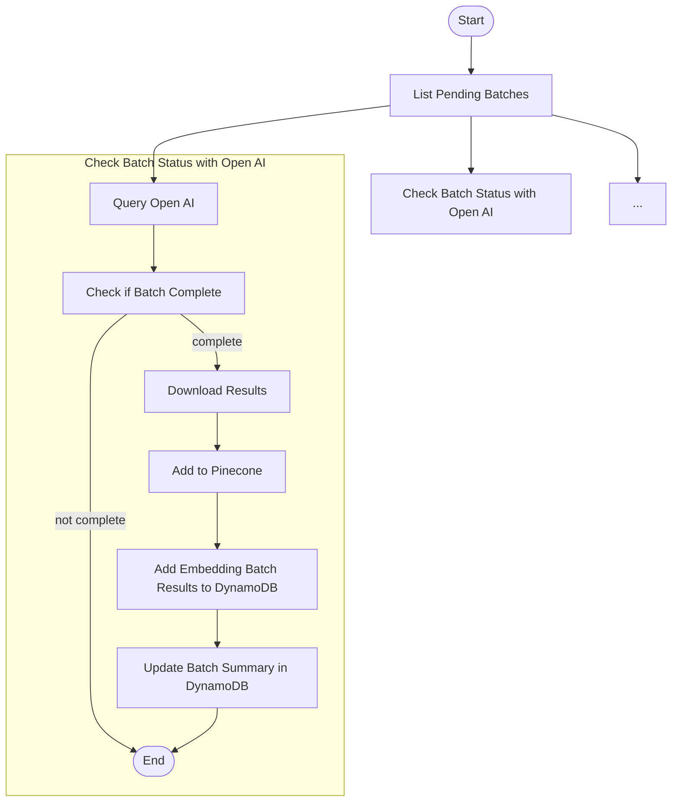

# Poll Embedding Batch

This Step Function periodically polls OpenAI batch embedding jobs and handles successful ingestion into Pinecone. The full flow includes error handling, retries, and updates to the DynamoDB label and batch state.

