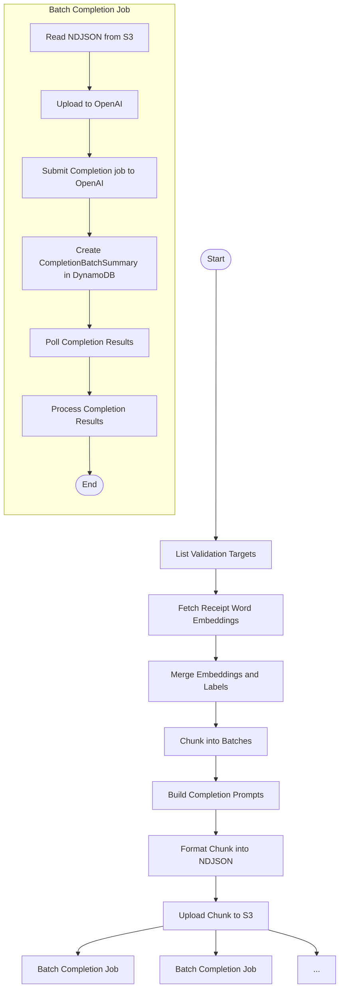

# Submit Completion Batch

This module defines the core logic for preparing and submitting completion batches to OpenAI's asynchronous Completion API. It is responsible for retrieving receipt word embeddings and their associated label metadata, constructing validation and refinement prompts for each item, formatting them into OpenAI-compliant payloads, and logging batch submissions along with their responses.

This is typically the second step in a two-phase Step Function pipeline, following the embedding batch submission.

---

## 📦 Functions

### `generate_completion_batch_id()`

Generates a unique UUID for each completion batch.

### `list_validation_targets()`

Fetches all `ReceiptWordLabel` items with `validation_status = "PENDING"` (or the flag indicating they need validation).

### `fetch_receipt_word_embeddings(labels)`

Retrieves receipt word embeddings and associated metadata (including OCR spatial data) for the given labels from DynamoDB or Pinecone.

### `join_labels_with_embeddings(labels, embeddings)`

Joins each label record with its corresponding embedding and OCR data.

### `chunk_joined_records(joined, batch_size)`

Splits the joined list into appropriately sized chunks for submission.

### `build_completion_prompts(joined_batch)`

Constructs validation/refinement prompts for each item in the batch, including context lines and examples.

### `format_openai_input(joined_prompts)`

Formats the batch of prompts into OpenAI-compliant NDJSON input.

### `write_ndjson(batch_id, input_data)`

Writes the formatted completion payload to a newline-delimited JSON file.

### `upload_ndjson_file(filepath)`

Uploads the NDJSON file to OpenAI's file endpoint for asynchronous completion.

### `submit_openai_completion_batch(file_id)`

Submits the completion batch job to OpenAI using the uploaded file ID, returning a job identifier.

### `create_completion_batch_summary(batch_id, joined)`

Creates a `CompletionBatchSummary` record in DynamoDB to track the job submission and metadata.

### `poll_completion_batch_results(batch_id)`

Periodically checks the status of the asynchronous completion job and retrieves results when complete.

### `process_completion_results(batch_id, results)`

Processes retrieved completion results and updates the corresponding `ReceiptWordLabel` items with `is_valid`, `correct_label`, and rationale.

## 📊 Step Function Architecture

