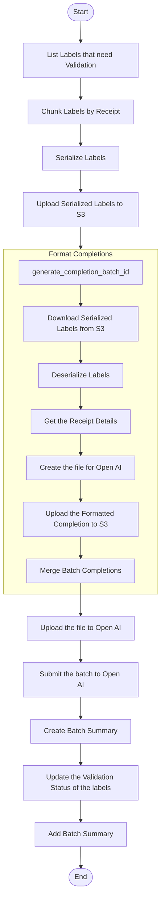

# Submit Completion Batch

This module defines the core logic for preparing and submitting completion batches to OpenAI's asynchronous Completion API. It is responsible for retrieving receipt word embeddings and their associated label metadata, constructing validation and refinement prompts for each item, formatting them into OpenAI-compliant payloads, and logging batch submissions along with their responses.

This is typically the second step in a two-phase Step Function pipeline, following the embedding batch submission.

---

## 📦 Functions

### `list_labels_that_need_validation() -> list[ReceiptWordLabel]`

Fetches all `ReceiptWordLabel` items with `validation_status = "PENDING"` (or the flag indicating they need validation).

### `chunk_into_completion_batches(labels: list[ReceiptWordLabel]) -> dict[str, dict[int, list[ReceiptWordLabel]]]`

Splits the list of pending `ReceiptWordLabel` records into chunks based on image ID and receipt ID.

### `serialize_labels(label_receipt_dict: dict[str, dict[int, list[ReceiptWordLabel]]]) -> list[dict]`

Serializes the chunks of labels into NDJSON files and returns a list describing each file.

### `upload_serialized_labels(serialized_labels: list[dict], s3_bucket: str, prefix="labels") -> list[dict]`

Uploads the serialized label files to an S3 bucket.

### `generate_completion_batch_id()`

Generates a unique UUID for each completion batch.

### `download_serialized_labels(serialized_label: dict) -> Path`

Downloads the serialized labels from S3.

### `deserialize_labels(filepath: Path) -> list[ReceiptWordLabel]`

Deserializes the NDJSON file into a list of ReceiptWordLabels

### `get_receipt_details(image_id: str, receipt_id: int) -> tuple[list[ReceiptLine], list[ReceiptWord], ReceiptMetadata]`

Fetches the metadata, lines and words for the receipt.

### `format_batch_completion_file(lines: list[ReceiptLine], words: list[ReceiptWord], labels: list[ReceiptWordLabel], metadata: ReceiptMetadata) -> Path`

Generates the NDJSON file for batch completions with OpenAI.

### `upload_to_openai(filepath: Path) -> FileObject`

Uploads the file to OpenAI.

### `upload_completion_batch_file(filepath: Path, s3_bucket: str, prefix: str) -> str`

Uploads the formatted NDJSON completion file to S3.

### `submit_openai_batch(file_id: str) -> Batch`

Submits the batch completion job to OpenAI.

### `create_batch_summary(batch_id: str, open_ai_batch_id: str, file_path: str) -> BatchSummary`

Creates a `BatchSummary` object based on the batch sent to OpenAI.

### `update_label_validation_status(labels: list[ReceiptWordLabel]) -> None`

Updates the validation status of the list of labels.

### `add_batch_summary(summary: BatchSummary) -> None`

Adds a batch summary to DynamoDB.

### `merge_ndjsons(s3_bucket: str, s3_keys: list[str], max_lines: int, max_size_bytes: int) -> list[tuple[Path, list[str]]]`

Merges NDJSON files from S3 into a single batch for OpenAI.

---

## 🧠 Usage

1. List all receipt word labels that need validation.
2. Chunk them by receipt and image.
3. Serialize the labels into NDJSON files.
4. Upload the serialized NDJSON files to S3.
5. For each serialized file:
   1. Generate a unique completion batch ID.
   2. Download the file from S3.
   3. Deserialize the label data.
   4. Fetch the associated receipt lines, words, and metadata.
   5. Format the batch completion NDJSON file for OpenAI.
   6. Upload the file to OpenAI.
   7. Submit the batch job to OpenAI.
   8. Create a batch summary for tracking.
   9. Update the validation status of all associated labels.
   10. Save the batch summary in DynamoDB.
6. End.

---

## 📊 Step Function Architecture

