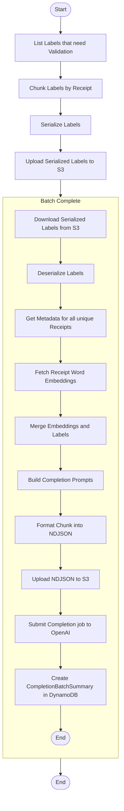

# Submit Completion Batch

This module defines the core logic for preparing and submitting completion batches to OpenAI's asynchronous Completion API. It is responsible for retrieving receipt word embeddings and their associated label metadata, constructing validation and refinement prompts for each item, formatting them into OpenAI-compliant payloads, and logging batch submissions along with their responses.

This is typically the second step in a two-phase Step Function pipeline, following the embedding batch submission.

---

## 📦 Functions

### `generate_completion_batch_id()`

Generates a unique UUID for each completion batch.

### `list_labels_that_need_validation() -> list[ReceiptWordLabel]`

Fetches all `ReceiptWordLabel` items with `validation_status = "PENDING"` (or the flag indicating they need validation).

### `chunk_into_completion_batches(labels: list[ReceiptWordLabel]) -> dict[str, dict[int, list[ReceiptWordLabel]]]`

Splits the list of pending `ReceiptWordLabel` records into chunks based on image ID and receipt ID.

### `get_receipt_metadatas(labels)`

Fetches the metadatas for all unique receipts in the chunk.

### `fetch_receipt_word_embeddings(labels, metadata)`

Retrieves receipt word embeddings based on the metadata for the given labels from DynamoDB or Pinecone.

### `form_prompts(vectors, labels, metadata)`

### `join_labels_with_embeddings(labels, embeddings)`

Joins each label record with its corresponding embedding and OCR data.

### `chunk_joined_records(joined, batch_size)`

Splits the joined list of items into sublists (chunks) of size `batch_size` for parallel processing.

### `write_ndjson(batch_id, input_data)`

Writes the provided `input_data` (NDJSON string) to a file named `{batch_id}.ndjson` in the local workspace.

### `build_completion_prompts(joined_batch)`

Constructs validation/refinement prompts for each item in the batch, including context lines and examples.

### `format_openai_input(joined_prompts)`

Formats the batch of prompts into OpenAI-compliant NDJSON input.

### `write_ndjson(batch_id, input_data)`

Writes the formatted completion payload to a newline-delimited JSON file.

### `upload_ndjson_file(filepath)`

Uploads the NDJSON file to OpenAI's file endpoint for asynchronous completion.

### `submit_openai_completion_batch(file_id)`

Submits the completion batch job to OpenAI using the uploaded file ID, returning a job identifier.

### `create_completion_batch_summary(batch_id, joined)`

Creates a `CompletionBatchSummary` record in DynamoDB to track the job submission and metadata.

> **Note:** Polling for completion results and processing them occurs in a separate Step Function module, not here.

---

## 🧠 Usage

---

1. List all receipt word labels that need validation.
2. Split them into manageable chunks.
3. For each chunk:
   1. Fetch the word embeddings.
   2. Merge embeddings with their labels.
   3. Build validation prompts.
   4. Format prompts as NDJSON.
   5. Upload the NDJSON file to S3.
   6. Submit the completion job to OpenAI.
   7. Create a CompletionBatchSummary record in DynamoDB.
4. End.

## 📊 Step Function Architecture

