# Submit Completion Batch

This module defines the core logic for preparing and submitting completion batches to OpenAI's asynchronous Completion API. It is responsible for retrieving receipt word embeddings and their associated label metadata, constructing validation and refinement prompts for each item, formatting them into OpenAI-compliant payloads, and logging batch submissions along with their responses.

This is typically the second step in a two-phase Step Function pipeline, following the embedding batch submission.

---

## 📦 Functions

### `list_labels_that_need_validation() -> list[ReceiptWordLabel]`

Fetches all `ReceiptWordLabel` items with `validation_status = "PENDING"` (or the flag indicating they need validation).

### `chunk_into_completion_batches(labels: list[ReceiptWordLabel]) -> dict[str, dict[int, list[ReceiptWordLabel]]]`

Splits the list of pending `ReceiptWordLabel` records into chunks based on image ID and receipt ID.

### `serialize_labels(label_receipt_dict: dict[str, dict[int, list[ReceiptWordLabel]]]) -> list[dict]`

Serializes the chunks of labels into NDJSON files and returns a list describing each file.

### `upload_serialized_labels(serialized_labels: list[dict], s3_bucket: str, prefix="labels") -> list[dict]`

Uploads the serialized label files to an S3 bucket.

### `generate_completion_batch_id()`

Generates a unique UUID for each completion batch.

### `download_serialized_labels(serialized_label: dict) -> Path`

Downloads the serialized labels from S3.

### `deserialize_labels(filepath: Path) -> list[ReceiptWordLabel]`

Deserializes the NDJSON file into a list of ReceiptWordLabels

### `get_receipt_details(image_id: str, receipt_id: int) -> tuple[list[ReceiptLine], list[ReceiptWord], ReceiptMetadata]`

Fetches the metadata, lines and words for the receipt.

### `format_batch_completion_file(lines: list[ReceiptLine], words: list[ReceiptWord], labels: list[ReceiptWordLabel], metadata: ReceiptMetadata) -> Path`

Generates the NDJSON file for batch completions with OpenAI.

### `upload_to_openai(filepath: Path) -> FileObject`

Uploads the file to OpenAI.

### `upload_completion_batch_file(filepath: Path, s3_bucket: str, prefix: str) -> str`

Uploads the formatted NDJSON completion file to S3.

### `submit_openai_batch(file_id: str) -> Batch`

Submits the batch completion job to OpenAI.

### `create_batch_summary(batch_id: str, open_ai_batch_id: str, file_path: str) -> BatchSummary`

Creates a `BatchSummary` object based on the batch sent to OpenAI.

### `update_label_validation_status(labels: list[ReceiptWordLabel]) -> None`

Updates the validation status of the list of labels.

### `add_batch_summary(summary: BatchSummary) -> None`

Adds a batch summary to DynamoDB.

### `merge_ndjsons(s3_bucket: str, s3_keys: list[str], max_lines: int, max_size_bytes: int) -> list[tuple[Path, list[str]]]`

Merges NDJSON files from S3 into a single batch for OpenAI.

---

## 🧠 Usage

1. **SubmitCompletionList** state

   1. Retrieve all `ReceiptWordLabel`s with `validation_status = NONE` using  
      `list_labels_that_need_validation()`.
   2. Group them by `(image_id, receipt_id)` via  
      `chunk_into_completion_batches()`.
   3. Serialize each group to a local NDJSON file with  
      `serialize_labels()`.
   4. Upload every NDJSON file to S3 using  
       `upload_serialized_labels()`.  
      _Output:_ an array of dictionaries—one per file—containing the `image_id`,  
      `receipt_id`, local `ndjson_path`, and its `s3_key`.

2. **FormatNDJSONs** state _(Map – runs once per label file)_

   1. Download the serialized label file from S3 →  
      `download_serialized_labels()`.
   2. Deserialize it back into `ReceiptWordLabel` objects →  
      `deserialize_labels()`.
   3. Fetch the receipt’s lines, words & metadata →  
      `get_receipt_details()`.
   4. Convert the labels into an OpenAI‑ready NDJSON prompt file →  
      `format_batch_completion_file()`.
   5. Upload that NDJSON back to S3 →  
       `upload_completion_batch_file()`.  
      _Output:_ S3 keys for the receipt‑level NDJSON files.

3. **BatchAndSubmitToOpenAI** state
   1. Merge all receipt‑level NDJSONs into ≤ 50 k‑line / 100 MB bundles  
      with `merge_ndjsons()`.
   2. Upload each merged file to the OpenAI _Files_ endpoint →  
      `upload_to_openai()`.
   3. Submit an OpenAI **Chat‑Completions Batch** job for every file →  
      `submit_openai_batch()`.
   4. Immediately mark every label present in the merged file as  
      `PENDING` → `update_label_validation_status()`.
   5. Build a `BatchSummary` from the merged file and job ID →  
      `create_batch_summary()`, then persist it via  
      `add_batch_summary()`.

> **Tip:** In production you almost never call these functions directly—kick off
> the _Validation Pipeline_ Step Function and it orchestrates the three Lambda
> states for you.

## 📊 Step Function Architecture

```mermaid
flowchart TB
    %% ───────── Stage 1  ─────────
    Start([Start]) --> list_labels_that_need_validation
    list_labels_that_need_validation --> chunk_into_completion_batches
    chunk_into_completion_batches --> serialize_labels
    serialize_labels --> upload_serialized_labels

    %% ───────── Stage 2 : Map  ─────────
    upload_serialized_labels --> PerReceiptMap

    subgraph PerReceiptMap["For **each** file"]
        direction TB
        download_serialized_labels --> deserialize_labels
        deserialize_labels --> get_receipt_details
        get_receipt_details --> format_batch_completion_file
        format_batch_completion_file --> upload_completion_batch_file
    end

    %% ───────── Stage 3  ─────────
    PerReceiptMap --> merge_ndjsons
    merge_ndjsons --> upload_to_openai
    upload_to_openai --> submit_openai_batch
    submit_openai_batch --> update_label_validation_status
    update_label_validation_status --> create_batch_summary
    create_batch_summary --> add_batch_summary
    add_batch_summary --> End([End])
```

