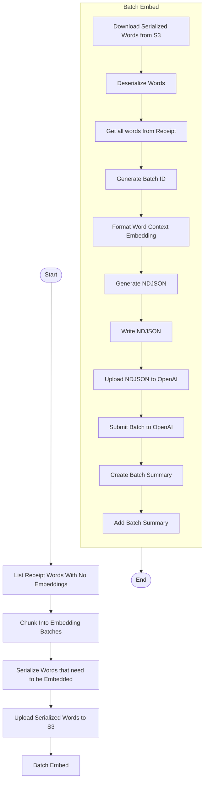

# Submit Embedding Batch

This module defines the core logic for preparing and submitting embedding batches to OpenAI's asynchronous Batch API. It is responsible for retrieving receipt word labels that have not yet been embedded, joining them with spatial OCR data, formatting the payload, and logging the batch submission.

This is typically the first step in a two-phase Step Function pipeline, followed later by a polling + processing step.

---

## 📦 Functions

### `list_receipt_words_with_no_embeddings()`

Fetches all ReceiptWords items with `embedding_status = "NONE"`.

### `serialize_receipt_words()`

Creates an NDJSON file with each line being a JSON representation of a ReceiptWord.

### `deserialize_receipt_words()`

Deserializes an NDJSON file where each line is a JSON representation of a Receipt word.

### `query_receipt_words(image_id, receipt_id)`

Gets all Receipt Words from a receipt by using the Receipt and Image IDs.

### `chunk_into_embedding_batches(receipt_words)`

Splits the list of ReceiptWords into chunks based on the combination of Receipt ID and Image ID.

### `generate_batch_id()`

Generates a unique UUID for each embedding batch.

### `format_word_context_embedding()`

Prepares OpenAI-compliant embedding payload that contains the words to the left and right.

### `format_spatial_embedding()`

Prepares OpenAI-compliant embedding payload that contains the word and its semantically descriptive description of the word's position on the page.

### `combine_embeddings()`

Combine the different embeddings to a single list.

### `generate_ndjson()`

Generate a local file for the embeddings provided.

### `write_ndjson(batch_id, input_data)`

Writes OpenAI batch payload to a newline-delimited JSON file.

### `upload_serialized_words()`

Uploads the NDJSON file containing serialized Receipt Words to S3.

### `download_serialized_words()`

Downloads the NDJSON file containing serialized Receipt Words from S3.

### `upload_to_openai(filepath)`

Uploads the NDJSON file to OpenAI's file endpoint for batch use.

### `submit_batch_to_openai(file_id)`

Submits the embedding job to OpenAI using the uploaded file ID.

### `create_batch_summary(batch_id, joined)`

Builds a BatchSummary entity with "PENDING" status.

### `add_batch_summary(batch_summary)`

Adds the batch summary to DynamoDB.

---

## 🧠 Usage

This module is split across two phases in a Step Function workflow:

### Phase 1: List Words That Need To Be Embedded

1. List all receipt words with `embedding_status = "NONE"`
2. Chunk the data into batches (by receipt)
   1. Serialize Receipt Words without embeddings per Receipt
   2. Store serialized words as NDJSON in S3

### Phase 2: Submit to OpenAI

1. Download serialized words that need to be embedded
2. Generate Batch ID
3. Format the word context embeddings for each word
4. Generate the NDJSON file for all embeddings
5. Upload the NDJSON to OpenAI
6. Submit the batch to OpenAI
7. Create the Batch Summary
8. Add the Batch Summary to DynamoDB

---

## 📊 Step Function Architecture

