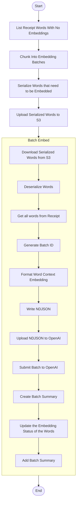

# Submit Embedding Batch

This module defines the core logic for preparing and submitting embedding batches to OpenAI's asynchronous Batch API. It is responsible for retrieving receipt word labels that have not yet been embedded, joining them with spatial OCR data, formatting the payload, and logging the batch submission.

This is typically the first step in a two-phase Step Function pipeline, followed later by a polling + processing step.

---

## 📦 Functions

### `list_receipt_words_with_no_embeddings() -> list[ReceiptWord]`

Fetches all ReceiptWords items with `embedding_status = "NONE"`.

### `chunk_into_embedding_batches(words: list[ReceiptWord]) -> dict[str, dict[int, list[ReceiptWord]]]`

Splits the list of ReceiptWords into chunks based on the combination of Receipt ID and Image ID.

### `serialize_receipt_words(word_receipt_dict: dict[str, dict[int, list[ReceiptWord]]]) -> list[dict]`

Creates an NDJSON file with each line being a JSON representation of a ReceiptWord. This function returns a list of dictionaries, each describing the Receipt ID, the Image ID, and the path of the NDJSON.

### `deserialize_receipt_words(filepath: Path) -> list[ReceiptWord]`

Deserializes an NDJSON file where each line is a JSON representation of a Receipt word.

### `query_receipt_words(image_id: str, receipt_id: int) -> list[ReceiptWord]`

Gets all Receipt Words from a receipt by using the Receipt and Image IDs.

### `generate_batch_id() -> str`

Generates a unique UUID for each embedding batch.

### `format_word_context_embedding(words_to_embed: list[ReceiptWord], all_words_in_receipt: list[ReceiptWord]) -> list[dict]`

Prepares the embedding that contains the target word, where the word is in the 3x3 top/middle/bottom, left/center/right grid, and the words to the left and right of the target word.

### `write_ndjson(batch_id: str, input_data: list[dict]) -> Path`

Writes OpenAI batch payload to a newline-delimited JSON file.

### `upload_serialized_words(serialized_words: list[dict], s3_bucket: str, prefix="embeddings") -> list[dict]`

Uploads the NDJSON file containing serialized Receipt Words to S3.

### `download_serialized_words(serialized_word: dict) -> Path`

Downloads the NDJSON file containing serialized Receipt Words from S3.

### `upload_to_openai(filepath: Path) -> FileObject`

Uploads the NDJSON file to OpenAI's file endpoint for batch use.

### `submit_openai_batch(file_id: str) -> Batch`

Submits the embedding job to OpenAI using the uploaded file ID.

### `create_batch_summary(batch_id: str, open_ai_batch_id: str, file_path: str) -> BatchSummary`

Builds a BatchSummary entity with "PENDING" status.

### `add_batch_summary(summary: BatchSummary) -> None`

Adds the batch summary to DynamoDB.

### `update_word_embedding_status(words: list[ReceiptWord]) -> None`

Updates the list of Receipt Words in DynamoDB to have an embedding status of "PENDING".

---

## 🧠 Usage

This module is split across two phases in a Step Function workflow:

### Phase 1: List Words That Need To Be Embedded

1. List all receipt words with `embedding_status = "NONE"`
2. Chunk the data into batches (by receipt)
   1. Serialize Receipt Words without embeddings per Receipt
   2. Store serialized words as NDJSON in S3

### Phase 2: Submit to OpenAI

1. Download serialized words that need to be embedded
2. Deserialize back into ReceiptWord
3. Query all ReceiptWords from the receipt
4. Generate Batch ID
5. Format the word context embeddings for each word
6. Write the embedding NDJSON file
7. Upload the NDJSON to OpenAI
8. Submit the batch to OpenAI
9. Create the Batch Summary
10. Update words's embedding statuses
11. Add the Batch Summary to DynamoDB

---

## 📊 Step Function Architecture

