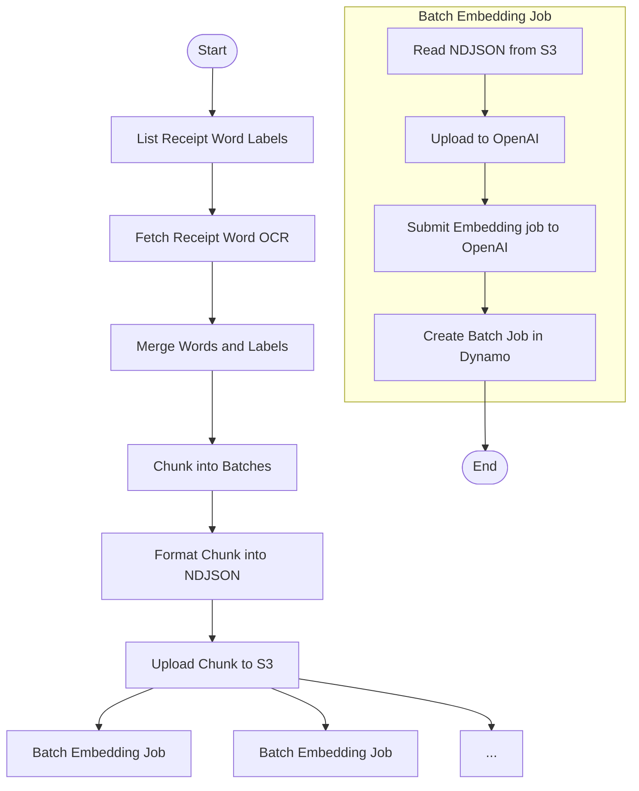

# Submit Embedding Batch

This module defines the core logic for preparing and submitting embedding batches to OpenAI's asynchronous Batch API. It is responsible for retrieving receipt word labels that have not yet been embedded, joining them with spatial OCR data, formatting the payload, and logging the batch submission.

This is typically the first step in a two-phase Step Function pipeline, followed later by a polling + processing step.

---

## 📦 Functions

### `generate_batch_id()`

Generates a unique UUID for each embedding batch.

### `list_receipt_word_labels()`

Fetches all ReceiptWordLabel items with `validation_status = "NONE"`.

### `fetch_receipt_words(labels)`

Batch fetches ReceiptWord entities based on label coordinates.

### `join_labels_with_words(labels, words)`

Joins ReceiptWordLabels with corresponding ReceiptWords using composite keys.

### `chunk_joined_pairs(joined, batch_size)`

Splits the joined list into safe-size chunks for embedding.

### `format_openai_input(joined_batch)`

Prepares OpenAI-compliant embedding payload from (label, word) pairs.

### `write_ndjson(batch_id, input_data)`

Writes OpenAI batch payload to a newline-delimited JSON file.

### `upload_ndjson_file(filepath)`

Uploads the NDJSON file to OpenAI's file endpoint for batch use.

### `submit_openai_batch(file_id)`

Submits the embedding job to OpenAI using the uploaded file ID.

### `create_batch_summary(batch_id, joined)`

Builds a BatchSummary entity to track the submitted batch.

---

## 🧠 Usage

This module is split across two phases in a Step Function workflow:

### Phase 1: Prepare Batches

1. List all receipt word labels with `validation_status = "NONE"`
2. Retrieve corresponding receipt word OCR data
3. Join each label with its matching word via composite key
4. Chunk the data into batches (e.g., 500 items each)
5. Format each chunk into OpenAI-compatible NDJSON
6. Upload each NDJSON file to S3
7. Return metadata for each batch (including `batch_id`, `s3_bucket`, and `s3_key`)

### Phase 2: Submit Batches (fanned out by Step Function `Map`)

1. Each fanned-out Lambda reads its NDJSON batch from S3
2. Uploads it to OpenAI's file endpoint
3. Submits the embedding batch job
4. Stores a `BatchSummary` entity in DynamoDB to track the job

---

## 📊 Step Function Architecture

