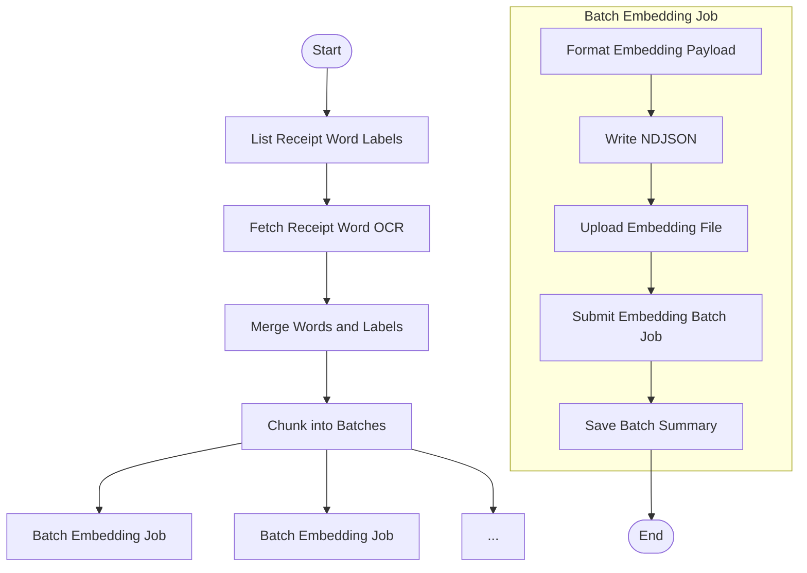

# Submit Embedding Batch

This module defines the core logic for preparing and submitting embedding batches to OpenAI's asynchronous Batch API. It is responsible for retrieving receipt word labels that have not yet been embedded, joining them with spatial OCR data, formatting the payload, and logging the batch submission.

This is typically the first step in a two-phase Step Function pipeline, followed later by a polling + processing step.

---

## 📦 Functions

### `generate_batch_id()`

Generates a unique UUID for each embedding batch.

### `list_receipt_word_labels()`

Fetches all ReceiptWordLabel items with `validation_status = "NONE"`.

### `fetch_receipt_words(labels)`

Batch fetches ReceiptWord entities based on label coordinates.

### `join_labels_with_words(labels, words)`

Joins ReceiptWordLabels with corresponding ReceiptWords using composite keys.

### `chunk_joined_pairs(joined, batch_size)`

Splits the joined list into safe-size chunks for embedding.

### `format_openai_input(joined_batch)`

Prepares OpenAI-compliant embedding payload from (label, word) pairs.

### `write_ndjson(batch_id, input_data)`

Writes OpenAI batch payload to a newline-delimited JSON file.

### `upload_ndjson_file(filepath)`

Uploads the NDJSON file to OpenAI's file endpoint for batch use.

### `submit_openai_batch(file_id)`

Submits the embedding job to OpenAI using the uploaded file ID.

### `create_batch_summary(batch_id, joined)`

Builds a BatchSummary entity to track the submitted batch.

---

## 🧠 Usage

This module is intended to be called from a Step Function or a job runner that:

1. Lists all receipt word labels with `validation_status = "NONE"`
2. Retrieves corresponding receipt word OCR data
3. Joins each label with its corresponding word by composite key
4. Chunks the dataset into batches (e.g., 500–1000 items)
5. For each batch, format embedding input payloads using OCR and label metadata
6. Write each batch to an NDJSON file
7. Upload the NDJSON file to OpenAI as a source file
8. Submit a batch embedding job and record the job ID
9. Store a `BatchSummary` per batch with submission metadata and receipt lineage

The output of this module is a fully-formed batch job that can be polled and processed by the downstream polling workflow.

