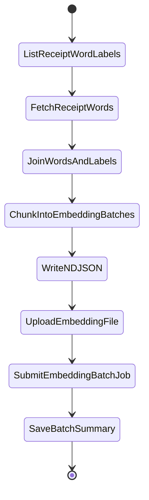

# Submit Embedding Batch

```mermaid
stateDiagram-v2
    [*] --> ListReceiptWordLabels
    ListReceiptWordLabels --> FetchReceiptWords
    FetchReceiptWords --> JoinWordsAndLabels
    JoinWordsAndLabels --> ChunkIntoEmbeddingBatches
    ChunkIntoEmbeddingBatches --> WriteNDJSON
    WriteNDJSON --> UploadEmbeddingFile
    UploadEmbeddingFile --> SubmitEmbeddingBatchJob
    SubmitEmbeddingBatchJob --> SaveBatchSummary
    SaveBatchSummary --> [*]
```
