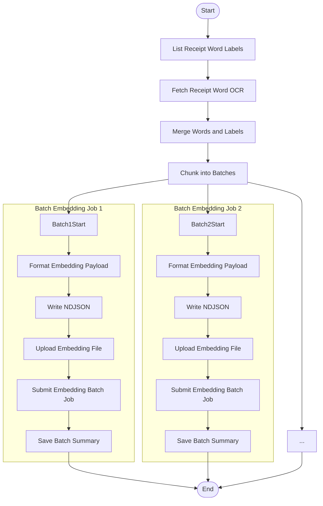

# Submit Embedding Batch

This module defines the core logic for preparing and submitting embedding batches to OpenAI's asynchronous Batch API. It is responsible for retrieving receipt word labels that have not yet been embedded, joining them with spatial OCR data, formatting the payload, and logging the batch submission.

This is typically the first step in a two-phase Step Function pipeline, followed later by a polling + processing step.

---

## 📦 Functions

### `generate_batch_id()`

Generates a unique UUID for each embedding batch, used as a primary key in the `BatchSummary` and `EmbeddingBatchResult` tables.

### `join_labels_with_words(labels, words)`

Joins a list of `ReceiptWordLabel` and `ReceiptWord` entities by their composite key (`image_id`, `receipt_id`, `line_id`, `word_id`). This produces a merged dataset ready for embedding.

### `create_batch_summary(batch_id, joined)`

Builds a `BatchSummary` entity for the given embedding batch. This includes:

- Receipt references
- Word count
- Submission timestamp
- Batch type
- Placeholder OpenAI batch ID

---

## 🧠 Usage

This module is intended to be called from a Step Function or a job runner that:

1. Lists all receipt word labels with `validation_status = "NONE"`
2. Retrieves corresponding receipt word OCR data
3. Joins each label with its corresponding word by composite key
4. Chunks the dataset into batches (e.g., 500–1000 items)
5. Converts each chunk into OpenAI embedding batch input
6. Writes input to NDJSON
7. Uploads the file to OpenAI's Batch API
8. Submits the batch job and records the job ID
9. Stores a `BatchSummary` with submission metadata and receipt lineage

The output of this module is a fully-formed batch job that can be polled and processed by the downstream polling workflow.

