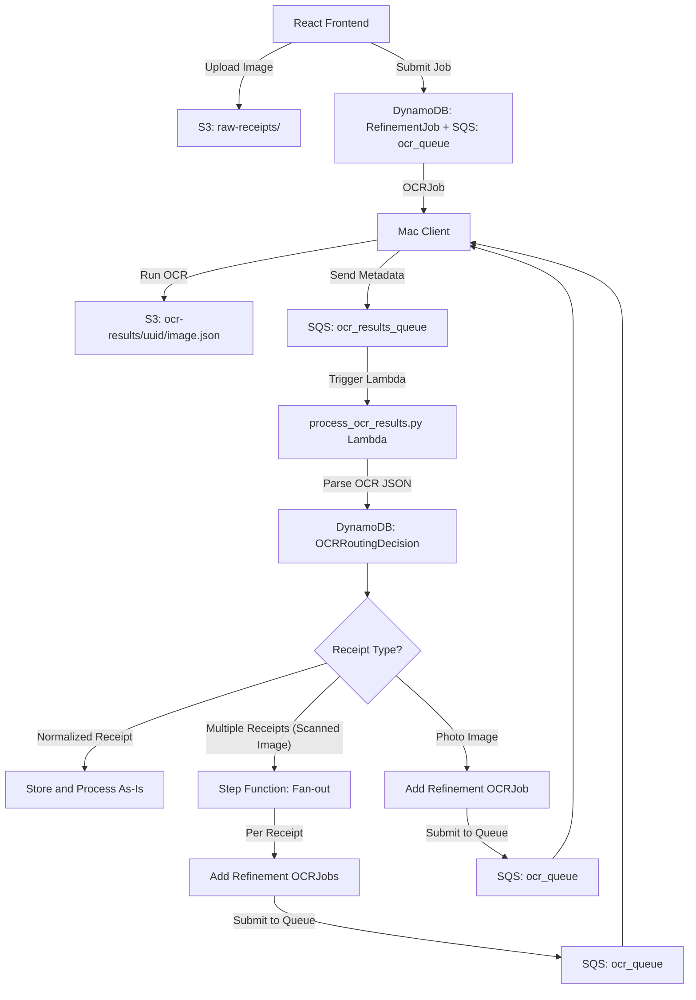

# Receipt Upload

`receipt_upload` coordinates OCR tasks for images uploaded from the portfolio
frontend. It executes Apple's Vision framework on Mac clients, stores the
results in DynamoDB/S3 and routes each image to the appropriate processing flow.
It is used by the `process_ocr_results` Lambda to classify scanned receipts and
photos before refinement.



## Installation

Install the package in editable mode so command line tools and dependencies are
available:

```bash
pip install -e .
```

Python 3.8+ is required. The key dependencies (see `pyproject.toml`) are
`Pillow`, `pillow-avif-plugin` and `boto3` for AWS integration.

## Quickstart

Run OCR on an image and classify its layout:

```python
from pathlib import Path
from tempfile import TemporaryDirectory
import json
from receipt_upload.ocr import apple_vision_ocr_job, process_ocr_dict_as_image
from receipt_upload.route_images import classify_image_layout

with TemporaryDirectory() as tmp:
    # Execute Apple's Vision OCR on a receipt photo
    json_files = apple_vision_ocr_job([Path("receipt.jpg")], Path(tmp))

    # Load results and determine if it's a scan or photo
    data = json.loads(Path(json_files[0]).read_text())
    lines, _, _ = process_ocr_dict_as_image(data, image_id="demo")
    image_type = classify_image_layout(lines, image_height=4032, image_width=3024)
    print(image_type)
```

## Bounding‑Box Improvements for Photo Receipts

Photo receipts often have perspective distortion. The
`receipt_processing.photo` module builds a convex hull of OCR words and refines
the extremes using Theil–Sen regressions. This geometry pipeline computes a
tighter receipt box and applies a perspective transform so downstream OCR sees a
straightened image.

## Documentation

- [Geometry utilities](receipt_upload/receipt_upload/README.md)
- [Receipt processing workflow](receipt_upload/receipt_upload/receipt_processing/README.md)

## TODO

- Clarify the coordinate system used for `Point` objects. A deterministic
  approach should make it obvious whether a point is expressed in OCR or
  image coordinates.
