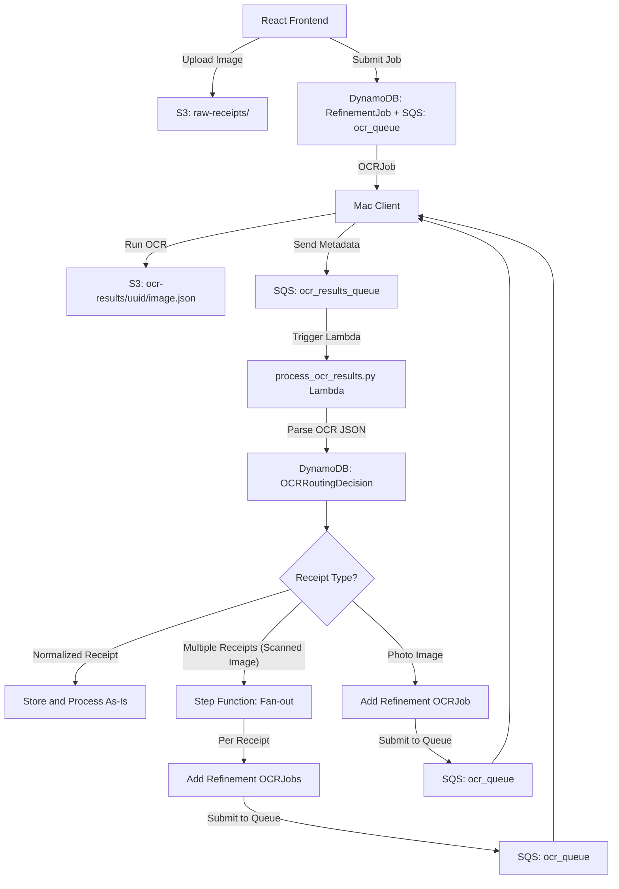

# Receipt Upload

This python package is used to run OCR on receipt images and store them in DynamoDB.

```mermaid
flowchart TD
  A[React Frontend] -->|Upload Image| B[S3: raw-receipts/]
  A -->|Submit Job| C[DynamoDB: RefinementJob + SQS: ocr_queue]

  C -->|OCRJob| D[Mac Client]
  D -->|Run OCR| E[S3: ocr-results/uuid/image.json]
  D -->|Send Metadata| F[SQS: ocr_results_queue]

  F -->|Trigger Lambda| G[process_ocr_results.py Lambda]
  G -->|Parse OCR JSON| H[DynamoDB: OCRRoutingDecision]
  H --> I{Receipt Type?}

  I -- Normalized Receipt --> J[Store and Process As-Is]
  I -- Multiple Receipts (Scanned Image) --> K[Step Function: Fan-out]
  K -->|Per Receipt| L[Add Refinement OCRJobs]
  L -->|Submit to Queue| C2[SQS: ocr_queue]
  C2 --> D
  I -- Photo Image --> M[Add Refinement OCRJob]
  M -->|Submit to Queue| C3[SQS: ocr_queue]
  C3 --> D
```
